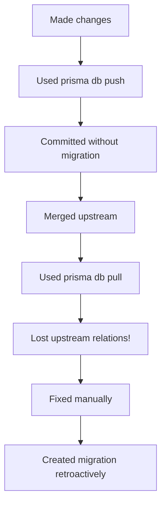
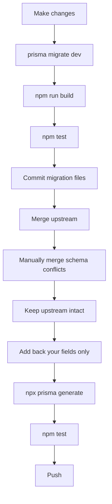

# Development Workflow Guide
## Best Practices for Schema Changes, Merges, and Testing

---

## 📋 Table of Contents
1. [Making Schema Changes](#making-schema-changes)
2. [Merging Upstream Changes](#merging-upstream-changes)
3. [Pre-Commit Checklist](#pre-commit-checklist)
4. [Running Tests](#running-tests)
5. [Common Pitfalls](#common-pitfalls)

---

## 🗄️ Making Schema Changes

### ✅ CORRECT Workflow:

1. **Edit the schema**
   ```bash
   # Edit prisma/schema.prisma
   # Add your fields/models
   ```

2. **Create a migration** (NOT `prisma db push`)
   ```bash
   npx prisma migrate dev --name descriptive_migration_name
   ```
   - This creates a migration file in `prisma/migrations/`
   - Applies it to your local dev database
   - Generates Prisma Client

3. **Commit the migration**
   ```bash
   git add prisma/migrations/
   git add prisma/schema.prisma
   git commit -m "Add migration: descriptive_migration_name"
   ```

### ❌ AVOID:

```bash
# DON'T use db push for permanent changes
npx prisma db push  # This doesn't create migration files!

# DON'T use db pull after making schema changes
npx prisma db pull  # This overwrites your schema with DB state!
```

### 🎯 When to use what:

| Command | Use Case | Creates Migration? |
|---------|----------|-------------------|
| `prisma migrate dev` | ✅ Adding features | ✅ Yes |
| `prisma db push` | ⚠️ Quick prototyping only | ❌ No |
| `prisma db pull` | ⚠️ Initial schema from existing DB | ❌ No |
| `prisma migrate deploy` | ✅ Production/CI deployment | Applies existing |

---

## 🔄 Merging Upstream Changes

### ✅ CORRECT Workflow:

1. **Create a backup branch FIRST**
   ```bash
   git checkout -b backup/feature-name-$(date +%Y%m%d-%H%M%S)
   git push origin backup/feature-name-$(date +%Y%m%d-%H%M%S)
   git checkout main
   ```

2. **Fetch and review upstream changes**
   ```bash
   git fetch upstream
   git log --oneline main..upstream/main
   git diff --stat main..upstream/main
   ```

3. **Check for schema conflicts BEFORE merging**
   ```bash
   git diff main..upstream/main -- prisma/schema.prisma
   ```

4. **Merge upstream**
   ```bash
   git merge upstream/main
   ```

5. **CRITICAL: DO NOT run `prisma db pull` after merge!**
   - ❌ `prisma db pull` will sync with DB and lose upstream schema changes
   - ✅ If schema has conflicts, manually merge the schema.prisma file
   - ✅ Keep upstream's relations and models intact
   - ✅ Add back only YOUR specific fields

6. **Verify schema integrity**
   ```bash
   # Check if all relations exist
   grep -A 5 "model IntegrationConfig" prisma/schema.prisma
   grep -A 5 "model Shipment" prisma/schema.prisma
   
   # Verify your changes are present
   grep "release" prisma/schema.prisma
   ```

7. **Regenerate Prisma Client**
   ```bash
   rm -rf node_modules/.prisma
   npx prisma generate
   ```

8. **Build and test**
   ```bash
   npm run build
   npm test
   ```

### ❌ What We Did Wrong (and fixed):

```bash
# ❌ WRONG: Used db pull after merge
git merge upstream/main
npx prisma db pull  # This removed upstream's relations!

# ✅ CORRECT: Use upstream schema + add your fields
git show upstream/main:prisma/schema.prisma > prisma/schema.prisma
# Then manually add back your specific fields
```

---

## ✅ Pre-Commit Checklist

Before committing ANY changes:

```bash
# 1. Check what files changed
git status
git diff

# 2. Verify you didn't break upstream code
#    - Check if you modified files you shouldn't have
#    - Review each changed file

# 3. Regenerate Prisma Client
npx prisma generate

# 4. Build the project
npm run build

# 5. Run tests
npm test

# 6. If tests fail:
#    - Check if it's related to your changes
#    - Check if migrations are missing
#    - Verify database schema matches Prisma schema

# 7. Stage only necessary files
git add <specific-files>

# 8. Commit with descriptive message
git commit -m "feat: description

- Detail 1
- Detail 2
- Fixes #123"

# 9. Push
git push origin main
```

---

## 🧪 Running Tests

### Local Tests:

```bash
# Run all tests
npm test

# Run specific test file
npm test tests/your-test.test.ts

# Run in watch mode during development
npm test -- --watch
```

### Debugging Test Failures:

1. **Schema-related errors** (`column does not exist`):
   ```bash
   # You're missing a migration!
   npx prisma migrate dev --name add_missing_column
   ```

2. **Type errors**:
   ```bash
   # Regenerate Prisma Client
   rm -rf node_modules/.prisma
   npx prisma generate
   ```

3. **CI/CD failures**:
   - Check if migrations are committed
   - Verify migration files are in `prisma/migrations/`
   - CI runs `prisma migrate deploy` which needs migration files

---

## ⚠️ Common Pitfalls

### 1. Using `prisma db push` instead of migrations

**Problem:** CI/CD fails because there's no migration file

**Solution:**
```bash
# Create migration from current schema state
npx prisma migrate dev --name describe_your_changes
git add prisma/migrations/
git commit -m "Add migration for changes"
```

### 2. Running `prisma db pull` after merge

**Problem:** Loses upstream schema relations/models

**Solution:**
```bash
# DON'T do this after merge:
git merge upstream/main
npx prisma db pull  # ❌ This overwrites with DB state

# DO this instead:
git merge upstream/main
# Manually resolve schema conflicts if any
# Keep upstream's schema structure intact
npx prisma generate
```

### 3. Not testing before pushing

**Problem:** CI fails, blocks other developers

**Solution:**
```bash
# ALWAYS before pushing:
npm run build  # Check TypeScript errors
npm test       # Run all tests
```

### 4. Modifying upstream files unintentionally

**Problem:** Break features you didn't intend to change

**Solution:**
```bash
# Before committing, review each file:
git diff src/modules/tracking/shipmentTracking.ts
git diff src/app/api/admin/integrations/route.ts

# Ask yourself:
# - Did I intend to change this?
# - Will this break upstream functionality?
# - Is there a better way?
```

### 5. Schema changes without migration

**Problem:** Works locally (you used db push) but fails in CI

**Solution:**
```bash
# If you already pushed schema changes:
# 1. Create migration from current state
npx prisma migrate dev --name add_your_changes --create-only

# 2. Review the generated SQL
cat prisma/migrations/TIMESTAMP_add_your_changes/migration.sql

# 3. Commit and push
git add prisma/migrations/
git commit -m "Add migration for schema changes"
git push
```

---

## 🎯 Quick Reference: Complete Feature Workflow

```bash
# 1. Start from clean main
git checkout main
git pull origin main

# 2. Create feature branch (optional but recommended)
git checkout -b feature/my-feature

# 3. Make changes
# - Edit code
# - Edit schema if needed

# 4. If schema changed:
npx prisma migrate dev --name add_my_feature

# 5. Test locally
npm run build
npm test

# 6. Commit
git add -A
git commit -m "feat: add my feature"

# 7. Before pushing, merge latest changes
git checkout main
git pull origin main
git checkout feature/my-feature
git merge main

# 8. If conflicts, resolve them
# DON'T use prisma db pull!

# 9. Test again after merge
npm run build
npm test

# 10. Push
git push origin feature/my-feature

# 11. Create PR or merge to main
git checkout main
git merge feature/my-feature
git push origin main
```

---

## 📊 Workflow Comparison

### What We Did Today (with issues):



### Correct Workflow:



---

## 🎓 Key Lessons

1. **Always use `prisma migrate dev`** for permanent schema changes
2. **Never use `prisma db pull`** after making schema modifications
3. **Create migrations** so CI/CD can apply them
4. **Test before pushing** (build + tests)
5. **Review changes carefully** before committing
6. **Keep upstream code intact** during merges
7. **Backup your work** before risky operations
8. **Document breaking changes** in commit messages

---

## 🆘 Emergency Recovery

If you accidentally broke something:

```bash
# 1. Check if you have a backup branch
git branch -a | grep backup

# 2. If yes, restore from backup
git checkout backup/your-feature-timestamp

# 3. If no backup, check reflog
git reflog  # Find the commit before you broke it
git reset --hard <commit-hash>

# 4. If you pushed, create a revert commit
git revert <bad-commit-hash>
git push origin main
```

---

## 📞 Need Help?

- **Schema issues:** Check prisma/schema.prisma integrity
- **Test failures:** Check if migrations are committed
- **Build errors:** Check if TypeScript types are up to date
- **Merge conflicts:** Ask before using `prisma db pull`!

---

**Remember:** When in doubt, create a backup branch first! 🛟
