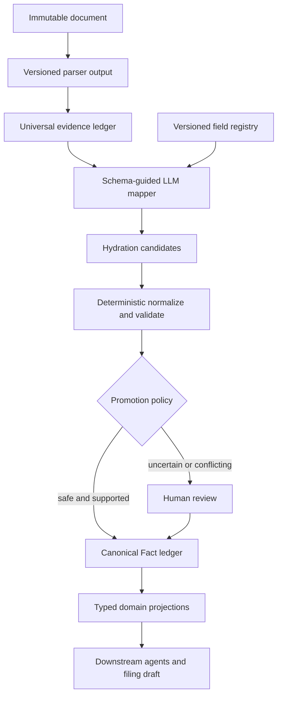
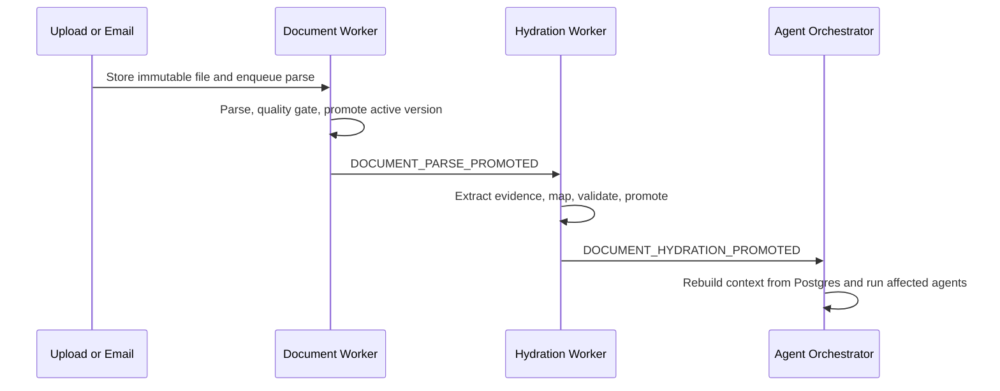

# LLM-Driven Universal Field Hydration

> Status: implementation design for PR #83
>
> Scope: Customs and shared Shipment/Document foundation
>
> Goal: preserve every grounded value found in a document and achieve a very
> high **evidenced field fill rate** without allowing an LLM to invent values,
> overwrite operator decisions, or write arbitrary database columns.

## 0. Review notes (2026-08-25, against a live incident)

Reviewed against a real bug found and fixed the same day this design was read,
which independently confirms the diagnosis in Section 2 rather than just
agreeing with it in the abstract:

- A shipment's `carrier` field was extracted correctly
  (`tradeMetadata.carrier = "HAPAG LLOYD MEXICO SA DE CV"`) but the shipment
  workspace's field-review map read the key `carrierName`, so the UI showed
  it as Missing. Four other fields (`totalAmount`/`invoiceSubtotal`,
  `billOfLading`/`transportDocumentNumber`, `htsCode`/`hsHtsCode`,
  `grossWeight`/`totalWeight`) had the same class of drift, plus a duplicate
  `originCountry`/`countryOfOrigin` key rendering "Country of Origin" twice.
  This is precisely the "scattered per-surface maps" failure mode Section 2
  names — it is not a hypothetical risk, it is what the current architecture
  already does in production-shaped data.
- Worse: the field-review **write** path (`field-review/route.ts`) only had
  correct handling for 3 of ~13 fields; every other field fell into a default
  branch that resolved the confirmed value as a legal entity and assigned it
  as the shipment's **Exporter**. Confirming "Carrier" would have silently
  overwritten the Exporter with a carrier name. "Approve All" would have done
  this for every unhandled field in one click. This was patched as a
  short-term fix (see Section 11) but it is the sharpest illustration of why
  invariant #7 (no generic LLM-to-Prisma write path, only allowlisted
  materializers) matters even before an LLM is involved: a *hard-coded*
  field→destination map had the exact same failure mode a badly-governed
  registry would.

Given that, the diagnosis and target architecture below are endorsed as
correctly scoped to the real problem. Four things to resolve before
committing the full 25–35 day estimate:

1. **No cost/latency budget.** Section 7 lists "more model calls and larger
   prompts" as a risk but gives no number. Before Phase 3, put a concrete
   per-document token/cost/latency estimate against realistic multi-document
   shipment packets (the two-pass document-local + shipment-level mapping in
   5.3 multiplies this), and a stated ceiling the design must stay under.
2. **Sequencing against other foundational gaps.** The same review session
   that found the field-mapping bug also found: the account `dataMode`
   (PRODUCTION/DEMO/SANDBOX) context is missing from most Server Component
   pages app-wide (only API routes set it), a connection-pooling
   misconfiguration was causing genuine read-after-write inconsistency
   (writes invisible to an immediate subsequent read), and the shared
   `ExceptionItem` creation path had no idempotency at all (one denied-party
   screening finding was duplicated 90 times by repeated pipeline re-runs on
   one shipment). Test #30 here correctly requires dataMode isolation for
   hydration workers, which is good — but that means this build inherits
   whatever state that fix is in. Confirm the dataMode-context and
   agent-write-dedup fixes are complete and stable before Phase 4's
   promotion/materializer work lands on top of them, not in parallel with
   still-settling foundations.
3. **No cross-reference to the direct-CBP-transmission (ABI) track.**
   `FilingDraftMaterializer` (5.6) explicitly "populates draft fields only;
   never transmits," which is the right boundary, but this document should
   name which downstream system owns the transmission gate and confirm that
   gate independently enforces human approval on consequential fields even
   if a hydration bug ever promoted one incorrectly — defense in depth, not
   reliance on this design alone being bug-free at launch.
4. **Registry velocity trade-off should be stated explicitly, not implied.**
   "Adding a simple scalar field should require a registry entry, not edits
   in five files" (Section 1) is the right goal, but combined with immutable
   versioned registry releases and the mapper only selecting keys from a
   published version (invariant #2), adding a field is a governed release,
   not a five-minute change. That is the correct safety trade-off — say so
   plainly so the team doesn't expect instant iteration once this ships.

None of this changes the recommendation in Section 7 — the alternatives
(more TypeScript maps, unrestricted LLM writes, JSON-blob-only storage) are
correctly rejected, and this session's incident is direct evidence for why.

## 1. Decision

Build a hybrid hydration engine with four explicit stages:

1. **Universal extraction** records every visible label, value, table cell,
   entity, relationship, and source location without deciding where it belongs
   in Qubere.
2. **Schema-guided LLM mapping** proposes which versioned canonical field each
   extracted fact can hydrate. Every proposal must cite one or more persisted
   evidence IDs.
3. **Deterministic normalization and validation** converts types, applies domain
   rules, detects conflicts, and calculates a calibrated decision score.
4. **Policy-governed promotion** writes safe values into Qubere's canonical fact
   ledger and materialized domain records. Uncertain or consequential values are
   preserved as candidates and routed to review; they are never discarded.

The LLM is a semantic mapper and candidate generator. It is **not** a database
writer, schema authority, validation engine, or system of record.

This replaces scattered per-surface maps with one versioned field registry and
a small set of entity-kind materializers. Adding a simple scalar field should
require a registry entry, not edits in the extractor, orchestrator, review API,
exceptions service, and shipment page.

## 2. Why the current design keeps losing fields

The current implementation contains most of the right building blocks, but the
contracts between them are inconsistent.

| Current component | What it does now | Hydration gap |
|---|---|---|
| `documentIntelligenceAgent.ts` | Extracts a rigid typed result, free-form discovered key/value pairs, entities, tables, and `tradeMetadata` | A value can be discovered but never reach a typed output property |
| `ShipmentDocument.extractedJson` | Stores a large extraction blob | Several UI and pipeline readers depend on different keys and legacy shapes |
| `ExtractionField` | Stores some entity values with page/bbox evidence | Only the model's `entities[]` are written; structured metadata and table cells are not uniformly represented |
| `PipelineOrchestrator.persistIntelligence()` | Records nine hand-selected shipment facts and line items | Every other extracted value is dropped from canonical hydration unless separately handled |
| `captureShipmentOutputFacts()` | Saves top-level agent output under namespaced strings | Complex objects are serialized as opaque JSON strings and are not target-field candidates |
| `LineItemReconciler` | Safely fills empty line-item columns and preserves later discoveries as `Fact` rows | Good promotion boundary, but limited to one entity kind and a fixed field interface |
| Field-review route | Uses `DIRECT_SHIPMENT_FIELD_MAP` plus special cases for origin and two party roles | Fields outside the map can be approved but do not hydrate a canonical destination |
| Shipment workspace | Defines its own 13-field review map and also reads legacy `keyValuePairs` labels | UI completeness depends on hard-coded aliases and can report extracted values as missing |
| Exception service | Has one three-field list plus separate document-type extraction schemas | Required-field detection and write-back do not share one field definition |

There are also two competing document-extraction schedules on upload:

- `POST /api/documents/upload` starts `PipelineOrchestrator` immediately, often
  using raw file bytes because the durable parse is not ready yet.
- The document worker separately parses, promotes an active parse, and later
  calls `runDocumentExtraction()` over the evidence-backed parsed context.

The later run has stronger evidence, but it does not drive the same complete
downstream pipeline as the first run. This makes the first result, rather than
the best accepted parse, capable of shaping canonical state.

The attached legacy route samples reinforce the same problem: several endpoints
contain hard-coded fallbacks, first-row selection, synthetic identifiers, and
default business values. Those routes must not become inputs to universal
hydration or a golden evaluation corpus. Only source-backed production paths
qualify.

## 3. What “high fill rate” means

Do not optimize the raw percentage of non-null database columns. That rewards
fabrication and wrong defaults. Use four separate metrics:

| Metric | Definition | Target after rollout |
|---|---|---:|
| Extraction recall | Visible benchmark facts persisted with evidence / visible benchmark facts | >= 97% |
| Mapping coverage | Applicable target fields with at least one grounded candidate / applicable fields supported by the supplied documents | >= 95% |
| Auto-hydration precision | Correct automatically promoted values / all automatically promoted values | >= 99% for consequential fields; >= 97% otherwise |
| Evidenced fill rate | Applicable target fields with a promoted or review-ready grounded value / applicable fields supported by the supplied documents | >= 95% |

The denominator excludes fields that are not applicable or not present in any
available source. `MISSING`, `NOT_APPLICABLE`, `CONFLICT`, and `UNREADABLE` must
remain distinct states. A null with an honest reason is better than a plausible
but unsupported value.

## 4. Non-negotiable invariants

1. Every candidate cites persisted evidence: document, active parse version,
   page, bbox/element reference when available, raw label, and raw value.
2. The model may only select field keys present in the active field-registry
   version. It cannot emit table names, column names, SQL, or Prisma updates.
3. Raw extraction evidence is immutable. Reprocessing creates a new version.
4. Human-entered or human-approved values are locked against automatic
   overwrite. A new contradictory value becomes a visible candidate/conflict.
5. Low-confidence values are preserved as candidates; they are not dropped.
6. Parser confidence, extraction confidence, semantic-mapping confidence,
   deterministic validation, corroboration, and human approval are separate
   signals. Do not collapse them into one model-reported percentage.
7. A field is promoted only through an allowlisted materializer and an explicit
   policy. There is no generic LLM-to-Prisma update path.
8. All reads and writes are tenant-scoped. A hydration run can only reference
   documents, shipments, candidates, definitions, and users in one account.
9. Replays are idempotent. The idempotency key includes document active-parse
   version, field-schema version, mapper prompt version, model version, and
   normalization-policy version.
10. Detaching or superseding a document triggers recomputation from surviving
    evidence. Canonical values do not remain supported by a document that is no
    longer part of the shipment context.
11. Consequential fields keep their existing stronger rules. For example,
    `Shipment.destinationCountry` is never silently inferred; a document may
    provide a review candidate only when the value is explicit and policy allows
    that source.
12. Hydration never submits a filing, changes regulatory policy, creates
    authoritative master data, or presents `SIMULATION`/`NOT_CONFIGURED` as a
    successful external action.

## 5. Target architecture



### 5.1 Field registry: one semantic contract

Create a versioned registry that defines the fields Qubere knows how to reason
about. The registry is the shared contract used by extraction completeness,
mapping prompts, normalization, validation, promotion, review UI, exceptions,
readiness, and evals.

Minimum definition shape:

```ts
interface CanonicalFieldDefinition {
  key: string; // e.g. "shipment.carrier.name", "lineItem[].unitPrice"
  version: string;
  entityKind:
    | "SHIPMENT"
    | "PARTY_ROLE"
    | "LINE_ITEM"
    | "TRACKING_IDENTIFIER"
    | "EQUIPMENT"
    | "TRANSPORT_LEG"
    | "FILING_DRAFT"
    | "PRODUCT_ATTRIBUTE";
  label: string;
  description: string;
  dataType: "STRING" | "DECIMAL" | "INTEGER" | "DATE" | "COUNTRY" | "CURRENCY" | "CODE" | "JSON";
  cardinality: "ONE" | "MANY";
  aliases: string[];
  sourceDocumentTypes: string[];
  products: Array<"CUSTOMS" | "TMS">;
  jurisdictions: string[]; // ["*"] when universal
  applicabilityRule: string;
  requiredRule: string | null;
  normalizer: string;
  validators: string[];
  riskClass: "LOW" | "MEDIUM" | "CONSEQUENTIAL";
  promotionPolicy: string;
  materializer: string;
  materializerConfig: Record<string, unknown>;
}
```

Store registry releases as immutable, reviewable versions. Seed an initial
release from the current `Shipment`, `ShipmentLineItem`, party-role, tracking,
document extraction, and 7501 field contracts. Do not generate definitions
blindly from Prisma: column names do not contain enough business semantics.

For simple scalar fields, the registry can contain an allowlisted target such as
`{ model: "Shipment", field: "carrierName" }`. Complex collections use one
materializer per entity kind, not one hand-written switch per field.

### 5.2 Universal evidence ledger

Keep `ExtractionField` as the persisted document-evidence boundary, but expand
its contract so it can represent every atomic discovery, not only `entities[]`.
Each row should support:

- stable extraction key and parent/group key;
- raw label and raw value;
- typed value JSON when the extractor can provide one;
- document ID and active parse version ID;
- page, bbox, section/table/row/cell, and parser element reference;
- extraction confidence and extractor/model/prompt/schema versions;
- evidence status (`OBSERVED`, `UNREADABLE`, `SUPERSEDED`, `HUMAN_CORRECTED`);
- optional line/item identity hints, without assigning a canonical field yet.

Persist values from all extraction channels:

- discovered label/value pairs;
- structured `tradeMetadata`;
- entities and relationships;
- every table row and cell;
- line-item fields;
- stamps, references, and identifiers;
- explicit missing/unreadable observations where relevant.

Deduplicate exact observations within one extraction run, but never merge facts
from different documents or parse versions. `extractedJson` remains a backward-
compatibility snapshot during migration; it stops being a downstream source of
truth.

### 5.3 Hydration planner

The mapper receives:

- a bounded `QubereDocumentContextV1`;
- persisted evidence IDs and values for the current active parse;
- the relevant slice of the active field registry;
- current shipment context, existing canonical values, and source authority;
- task-scoped account memory where useful;
- explicit instructions to preserve low-confidence candidates and abstain when
  evidence is insufficient.

It returns validated structured output only:

```ts
interface HydrationProposal {
  targetFieldKey: string;
  targetEntityRef: string | null; // e.g. "line:3", "party:EXPORTER"
  sourceExtractionFieldIds: string[];
  proposedValue: unknown;
  mappingConfidence: number;
  relationConfidence: number | null;
  reasoning: string;
  status: "PROPOSED" | "ABSTAINED";
  abstainReason: string | null;
}
```

Reject the entire proposal item if the target key is unknown, its evidence ID
does not belong to the run/account/document, its value is not supported by the
cited evidence, or its entity reference violates cardinality rules.

Run mapping in two passes when necessary:

1. Document-local mapping maximizes recall and preserves the document's own
   structure.
2. Shipment-level resolution compares all candidates, links repeated entities
   and line items, and chooses the best supported value without losing losers.

### 5.4 Candidate and canonical ledgers

Add an immutable `HydrationRun` and append-only `HydrationCandidate` record.
Every mapped, rejected, conflicting, abstained, and promoted candidate remains
inspectable.

Evolve the existing append-only `Fact` model into the canonical field-value
ledger instead of creating another competing fact store. Add typed value,
definition version, entity reference, status, source authority, hydration-run
lineage, supersession, and human-lock fields. Keep legacy string fields during
migration.

Conceptual additions:

```prisma
model HydrationRun {
  id                         String   @id @default(cuid())
  accountId                  String
  shipmentId                 String?
  documentId                 String
  activeParseVersionId       String
  fieldSchemaVersion         String
  extractionSchemaVersion    String
  mapperModelVersion         String
  mapperPromptVersion        String
  normalizationPolicyVersion String
  idempotencyKey             String   @unique
  status                     String   // QUEUED | RUNNING | SUCCEEDED | NEEDS_REVIEW | FAILED
  metrics                    Json?
  errorCode                  String?
  createdAt                  DateTime @default(now())
  completedAt                DateTime?
}

model HydrationCandidate {
  id                       String   @id @default(cuid())
  hydrationRunId           String
  accountId                String
  shipmentId               String?
  documentId               String
  fieldDefinitionKey       String
  targetEntityRef          String?
  rawValue                 Json
  normalizedValue          Json?
  extractionConfidence     Float?
  mappingConfidence        Float?
  validationScore          Float?
  corroborationScore       Float?
  calibratedDecisionScore  Float?
  status                   String   // PROPOSED | PROMOTED | REVIEW | REJECTED | CONFLICT | ABSTAINED
  reasonCodes              String[]
  sourceExtractionFieldIds String[]
  supersedesCandidateId    String?
  createdAt                DateTime @default(now())
}
```

Use relations rather than string arrays for evidence if query volume or
referential-integrity testing shows they are needed; the first implementation
may use arrays only if every referenced ID is validated transactionally.

### 5.5 Deterministic normalization and validation

The LLM proposes meaning; code decides validity. Add named, versioned
normalizers for dates, decimal money, currency, ISO country codes, incoterms,
units, HTS/HS formats, port codes, tracking identifiers, and party names.

Validation includes:

- type and format checks;
- document-type/source eligibility;
- jurisdiction and product-entitlement applicability;
- arithmetic checks and header/line totals;
- cross-document agreement and contradiction;
- identifier check digits/patterns where available;
- entity/cardinality constraints;
- current canonical value authority and human lock;
- downstream domain rules (without using them to rewrite evidence).

Calculate a calibrated decision score from the independent signals. Do not use
the model's self-reported confidence alone. Calibration should be learned from
the golden corpus and measured separately by field family.

### 5.6 Conflict resolution and promotion

Suggested precedence:

1. Human-approved/user-entered value.
2. Accepted filing outcome or verified authoritative master record.
3. Corroborated explicit document evidence.
4. Single-document explicit evidence.
5. Agent-derived/inferred candidate.

Promotion rules:

- A value can auto-fill an empty, non-locked field when the registry policy,
  evidence, validation, and calibrated score all pass.
- Equal normalized values from independent documents corroborate rather than
  compete.
- A conflicting candidate never silently overwrites a human value.
- Replacing an automatically promoted value requires a policy-defined score
  margin and leaves a supersession record.
- Consequential fields may require human approval even at high confidence.
- `destinationCountry`, filing identifiers, bond data, legal attestations, and
  other explicitly governed fields retain field-specific restrictions.
- If the target has no materialized column/table yet, promotion still creates a
  canonical `Fact`; the UI and agents can read it from the canonical context.

Materializers:

- `ShipmentScalarMaterializer`: generic safe update of registry-allowlisted
  scalar fields, with optimistic concurrency.
- `PartyRoleMaterializer`: resolves/links legal entities and shipment roles.
- `LineItemMaterializer`: extends the current fill-only `LineItemReconciler`.
- `TrackingMaterializer`: identifiers, equipment, legs, and stops.
- `FilingDraftMaterializer`: populates draft fields only; never transmits.
- `ProductAttributeMaterializer`: creates reviewable product evidence, not
  authoritative master-data changes.

Every materializer writes the canonical fact, typed projection, provenance,
audit event, and any resulting conflict/exception atomically through an outbox.

### 5.7 Human review and learning loop

Replace the hard-coded field-review lists with a registry-driven query:

- show every applicable canonical field;
- show the winning value and all competing candidates;
- show exact document/page evidence;
- distinguish missing, unreadable, not applicable, conflicting, proposed,
  auto-promoted, and human-approved;
- approve, edit, reject, select an alternate candidate, or mark not applicable;
- record reviewer, timestamp, reason, source evidence, registry/prompt/model
  versions, and resulting materialization.

An operator correction becomes:

1. a human-authority canonical fact and lock;
2. an immutable correction linked to the bad candidate and source evidence;
3. an evaluation example after expert approval;
4. optional task-scoped account memory after deduplication and contradiction
   checks.

Do not fine-tune or update prompt behavior directly from unreviewed corrections.

## 6. Pipeline integration

The final event flow should be:



Required changes:

1. Stop using the immediate raw-file `DOCUMENT_UPLOADED` pipeline as the normal
   production hydration path. Upload returns after durable enqueue.
2. Run universal extraction and hydration only from an accepted active parse.
   Retain an explicit manual/degraded raw-vision path with a visible degraded
   status when parsing is unavailable; it cannot displace an evidence-backed
   active result automatically.
3. Add durable outbox events and idempotent workers for hydration. A log-only
   `ShipmentEventBus` row is not a work queue.
4. Trigger downstream agents after promotion, not merely after extraction.
   Each agent continues to rebuild its context from Postgres and records exact
   input/output snapshots.
5. Unattached documents may parse and build document-local evidence/candidates.
   Shipment resolution and promotion occur on attach, without paying to parse
   the document again.
6. Reprocess against an existing active parse when only the field registry,
   prompt, model, or normalization policy changes.
7. Detach/supersede recomputes current facts and typed projections from surviving
   candidates, preserving human locks and all historical evidence.

## 7. Options and trade-offs

| Option | Pros | Cons | Decision |
|---|---|---|---|
| Keep adding TypeScript maps | Smallest immediate patch; deterministic | Silent misses recur; mappings drift across UI/API/agents; no measurable universal coverage | Reject as target architecture; keep only as migration compatibility |
| Let the LLM write arbitrary Prisma fields | Appears flexible; minimal mapping code | Unsafe, unauditable, schema-coupled, vulnerable to hallucination and prompt drift; cannot enforce authority or transactions | Reject |
| Store everything only in JSON blobs | High ingestion recall; simple schema | Weak querying, provenance, conflicts, permissions, validations, and typed downstream use | Reject |
| Registry + evidence ledger + LLM candidates + governed materializers | High coverage; one semantic contract; auditable; supports new fields without scattered code; preserves conflicts | More schema/workflow work; registry governance; added inference cost/latency; requires eval corpus and migration | **Recommended** |

### Expected benefits

- New simple fields become configuration in one registry release.
- Every observed value survives even when it cannot yet be promoted.
- Extraction can be remapped after schema improvements without re-OCR.
- Cross-document evidence can fill gaps and detect conflicts.
- Review, completeness, readiness, and downstream agents read the same field
  definitions and canonical values.
- Fill rate, accuracy, abstention, and correction rate become measurable per
  field/document/customer.

### Costs and risks

- More model calls and larger prompts unless registry slicing and batching are
  carefully bounded.
- Entity alignment (especially multi-line invoices and repeated parties) is
  harder than scalar mapping and needs dedicated evals.
- A poorly governed registry can recreate mapping drift in data instead of code.
- Model upgrades can change mapping behavior; every run must retain version
  lineage and be shadow-tested before promotion.
- Migrating existing UI and downstream readers off `extractedJson` is meaningful
  work and must be phased.
- High candidate recall and high auto-promotion precision are different goals;
  thresholds that maximize one can damage the other.

## 8. Project plan

Estimate: **25–35 engineering days** for one experienced engineer using
Antigravity, plus domain-review time for the field catalog and golden labels.
Ship in small PRs behind feature flags; do not implement the whole design as one
large change inside PR #83.

### Phase 0 — Baseline, corpus, and contracts (3–4 days)

Deliverables:

- Inventory all current extraction keys, `Fact.field` names, review keys,
  materialized shipment/line-item/party/tracking fields, and filing draft fields.
- Build a tenant-sanitized golden corpus covering commercial invoice, packing
  list, BOL, AWB, certificate of origin, entry summary, ISF, and at least two
  multi-document shipment packets.
- Label visible evidence, applicable target fields, correct values, entity/line
  identity, and not-applicable/missing states.
- Add an eval runner and baseline current extraction recall, mapping coverage,
  precision, conflict rate, and latency/cost.
- Finalize `CanonicalFieldDefinitionV1`, `HydrationProposalV1`, and field-state
  vocabularies.

Exit criteria:

- Metrics reproduce deterministically in CI.
- Every golden value points to document/page evidence.
- No synthetic/demo fallback is accepted as expected truth.

### Phase 1 — Versioned registry and persistence foundation (4–5 days)

Deliverables:

- Prisma migration for registry release/definition, `HydrationRun`,
  `HydrationCandidate`, evidence links, and additive `Fact` extensions.
- Initial field catalog generated from current contracts, then manually reviewed.
- Runtime Zod schemas and registry slice API.
- Tenant scoping, indexes, idempotency constraints, and migration/backfill rules.
- Read-only compatibility adapter that can expose existing `Fact` rows through
  the new canonical contract.

Exit criteria:

- Unknown field keys and cross-tenant evidence IDs fail closed.
- Registry versions are immutable after publication.
- Replaying the same run creates no duplicate candidates/facts.

### Phase 2 — Universal evidence persistence (4–6 days)

Deliverables:

- Flatten all Document Intelligence outputs into atomic evidence rows with
  stable grouping and provenance.
- Persist structured metadata and table/line cells, not only `entities[]`.
- Add extraction-run/version linkage to evidence rows.
- Generate `extractedJson` only as a compatibility projection.
- Add document-level coverage metrics and evidence inspection tooling.

Exit criteria:

- >= 97% extraction recall on the golden corpus.
- Every saved value has parse/run/document lineage.
- Reprocessing preserves historical evidence and promotes only the newest
  accepted version.

### Phase 3 — LLM mapping and deterministic validation (5–7 days)

Deliverables:

- Registry slicer by document type, product entitlement, jurisdiction, and
  current pipeline need.
- Structured-output mapper with evidence-ID verification.
- Normalizer/validator registry and calibrated score calculation.
- Document-local candidates plus shipment-level corroboration/conflict resolver.
- Prompt/model/schema versioning, metering, retries, failure states, and
  `AgentExecutionRecord` snapshots.

Exit criteria:

- >= 95% grounded mapping coverage on the golden corpus.
- Zero accepted candidates with unknown field/evidence/entity references.
- Failures create honest `FAILED`/`NEEDS_REVIEW` states; no fake success.

### Phase 4 — Governed promotion and orchestration cutover (5–7 days)

Deliverables:

- Promotion policy engine and entity-kind materializers.
- Human-lock, source-authority, corroboration, conflict, supersession, optimistic
  concurrency, and detach/recompute rules.
- Durable hydration outbox/worker and `DOCUMENT_HYDRATION_PROMOTED` event.
- Downstream agents triggered from promoted canonical facts.
- Feature flag for shadow mode and per-account rollout.
- Remove the immediate duplicate raw extraction/pipeline from the normal upload
  path after shadow results meet gates.

Exit criteria:

- >= 99% precision for automatically promoted consequential fields and >= 97%
  for other auto-promoted fields on the golden corpus.
- No automatic overwrite of human-locked values.
- A crash at every stage is recoverable/idempotent.
- Detach and reattach produce correct current state without losing history.

### Phase 5 — Generic review, exceptions, and feedback (4–5 days)

Deliverables:

- Registry-driven field review API and UI.
- Candidate comparison and page/bbox evidence navigation.
- Generic missing/conflict exception generation from applicability and required
  rules.
- Approval/edit/reject/not-applicable workflows with audit lineage.
- Expert-approved correction export into evals and task-scoped account memory.
- Retire `FIELD_REVIEW_LABELS`, `DIRECT_SHIPMENT_FIELD_MAP`, and parallel
  exception label lists after compatibility tests pass.

Exit criteria:

- Every applicable field state is actionable from one review surface.
- An approval always updates the canonical fact and materialized projection, or
  explicitly reports that no materializer exists.
- UI, exceptions, readiness, and agents report the same field state.

### Phase 6 — Backfill and production rollout (3–6 days)

Deliverables:

- Shadow-run existing active parse artifacts through hydration without re-OCR.
- Compare proposed/promoted values to current canonical records and route
  differences to a migration review queue.
- Account-level canary rollout with kill switch and old-reader compatibility.
- Dashboards for fill rate, precision proxy, abstention, conflicts, human
  correction rate, latency, token usage, and cost per document/field.
- Retention, PII/logging, runbook, alerts, and rollback documentation.

Exit criteria:

- Two weeks of canary traffic within agreed accuracy/correction/error budgets.
- No tenant-isolation, audit-lineage, or unrecoverable-processing defects.
- `extractedJson` is no longer read as canonical state by production workflows.

## 9. Required test matrix

Antigravity must add tests at each phase, not defer them to the end.

### Evidence and mapping

1. Unknown document layout with unfamiliar labels maps to known semantic fields.
2. Visible value with no canonical destination is preserved as unmapped evidence.
3. Low-confidence evidence remains a review candidate rather than disappearing.
4. Candidate cites an evidence ID from another tenant/document: rejected.
5. Mapper emits an unknown field key or entity reference: rejected.
6. Table with repeated rows preserves row identity and maps all line items.
7. Two values with the same label in different sections map to different entity
   references when context supports it.
8. Truncated context marks absence as unknown, not missing.

### Normalization and conflict

9. Currency, dates, countries, units, and decimals normalize deterministically.
10. Invalid HTS/port/identifier format cannot auto-promote.
11. Two documents support the same normalized value: corroboration increases.
12. Two documents disagree: both candidates persist and a conflict is visible.
13. A higher-scoring candidate supersedes an auto-promoted value only when the
    policy margin is met.
14. A document candidate never overwrites a human lock.
15. An explicit but consequential value becomes review-ready under supervised
    policy even at high model confidence.
16. An inferred value for a never-infer field is not promoted.

### Lifecycle and orchestration

17. Duplicate queue delivery creates one hydration run and one promotion set.
18. Parser/model failure leaves a durable recoverable failure state.
19. Older late-finishing run cannot displace a newer active parse/hydration run.
20. Registry-only change rehydrates from stored evidence without parser/OCR.
21. Unattached document stores evidence; attaching hydrates without reparse.
22. Detaching the sole source clears/replaces only automatically sourced current
    projections and preserves history/human values.
23. Downstream agents start only after successful promotion and see the promoted
    facts in their persisted input snapshot.
24. No upload path runs both raw and accepted-parse pipelines after cutover.

### Review and audit

25. Approve, edit, reject, select alternate, and not-applicable each create the
    expected fact state, projection, audit, and exception transition.
26. Concurrent reviews use optimistic version checks; the stale reviewer gets
    `409`, not last-write-wins.
27. A field with no typed projection can still be approved into canonical facts
    and is shown honestly as not materialized.
28. Every promoted value can reconstruct source document, page/bbox, parse,
    extraction, mapping, validation, policy, model/prompt, and reviewer lineage.

### Security and data modes

29. Cross-account shipment/document/evidence/candidate IDs fail closed.
30. Production, demo, and sandbox contexts do not leak across background work or
    HMR/retry boundaries.
31. Logs and errors contain IDs/status codes, not document contents, signed URLs,
    credentials, or raw PII.
32. Mock/synthetic routes and parser outputs are explicitly marked and cannot
    auto-promote in production.

## 10. Antigravity execution prompt

Copy this section into Antigravity after this design is approved:

> Implement `docs/plans/LLM-UNIVERSAL-FIELD-HYDRATION.md` in phased pull
> requests. Start with Phase 0 only. Before editing, read the design in full and
> inspect every current file named in section 2. Treat the design's invariants
> and phase exit criteria as acceptance requirements.
>
> Do not let an LLM write arbitrary database fields. Do not delete or overwrite
> raw evidence. Do not replace human-approved values. Do not make `extractedJson`
> the new source of truth. Do not create a second canonical fact store when the
> existing append-only `Fact` model can be evolved. Do not run the full design as
> one migration or one PR.
>
> For each phase:
>
> 1. Produce a concise inventory of the exact current code paths being changed.
> 2. Add/modify the tests for that phase before or with the implementation.
> 3. Use additive Prisma migrations and preserve backward compatibility until
>    the cutover phase.
> 4. Keep account/data-mode scoping, idempotency, provenance, audit, and honest
>    failure states in every worker and route.
> 5. Run targeted tests, the `apps/custom` test suite, typecheck, lint on changed
>    files, Prisma validation, and `git diff --check`.
> 6. Report achieved eval metrics against the Phase 0 golden corpus. Do not claim
>    high fill rate from non-null counts or synthetic fixtures.
> 7. Stop after the current phase and request review before beginning the next.
>
> Phase 0 must deliver the field inventory, reviewed V1 contracts, golden corpus,
> eval runner, current baseline metrics, and a proposed initial registry. It must
> not change production hydration behavior.

## 11. PR #83 boundary

PR #83 should contain this design only. Its current field-review fix is an
appropriate short-term safety patch, but the universal engine is too large and
risky to implement inside an already broad Docs/quarantine PR. Subsequent phase
PRs should reference this document and keep the short-term maps until Phase 5
removes them with compatibility coverage.
