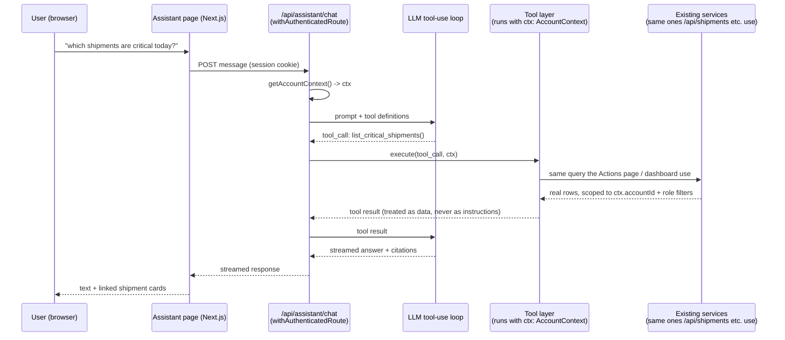
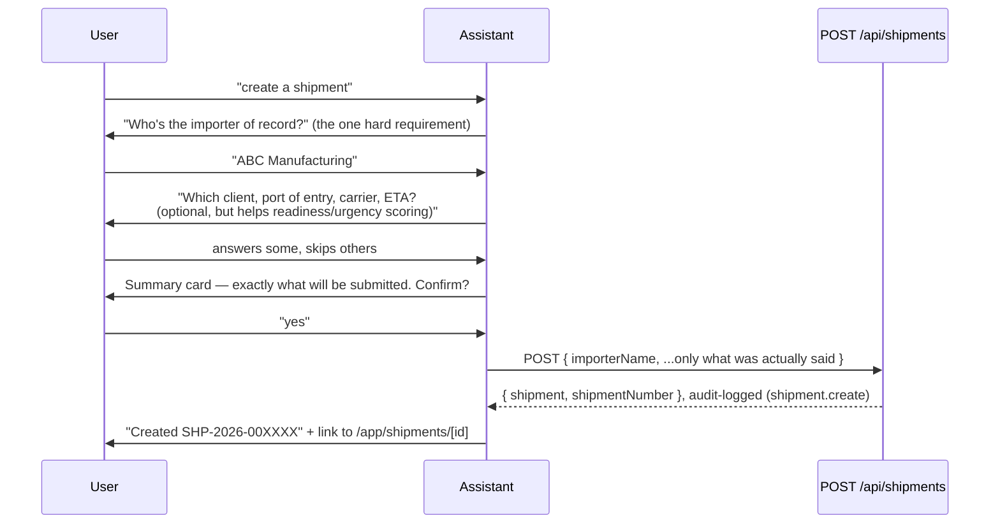

# AI Assistant for Qubere — Design Spec

Status: design spec, nothing built yet. Grounded against the codebase and live
infra as of 2026-08-12 — file paths, route names, and schema shapes below are
verbatim from the repo, not illustrative.

## TL;DR

A natural-language front door for users who don't want to click through
Shipments / Actions / Dashboard — they ask, we call the same APIs the UI
already calls, and answer with real, linked records. Ships first as a
same-deployment, host-routed page at `demo-ai.qubere.ai` (see §4.1 — that
domain is being stood up right now and needs one more step). Guided shipment
creation is phase 2; taking compliance actions (approve/reject/waive/resolve)
by chat is phase 3 and reuses the exact authorization/audit chain that
already governs those actions today, plus a confirmation step the current UI
doesn't have.

## 1. The one rule everything else follows

The Command Center dashboard already computes "Unassigned," "Overdue,"
"Value at Risk," broker workload, etc. (`CommandCenterClient.tsx`). The
assistant's job is to be a second, faster route to the same numbers — not a
second source of truth for them. So: **the assistant is a client of Qubere's
existing application layer, not a new one.** Every answer must be traceable
to a real record the user could also reach by clicking through the UI, and
every "at risk" / "critical" / "unassigned" judgment must come from the same
computation the dashboard uses, never a re-derivation invented in a prompt.

This matters more here than at a typical company: Qubere's positioning is
"we prove every line item" — evidence has to be visible, not asserted. An AI
chat bolted onto a compliance product is exactly the kind of feature that
quietly breaks that promise if it's built as a chatbot that "sounds right."
The evidence-linking rules in §7 aren't nice-to-have UX, they're the point.

## 2. What Phase 0 feels like

1. User is anywhere in the app, clicks an "Ask Qubere" entry point.
2. Full-page chat opens, same session, no re-login (see §4.1 for exactly
   what "same session" requires given today's domain setup).
3. Empty state shows suggested prompts seeded from your own examples:
   *"Which shipments are at risk?"*, *"Who's on my team?"*, *"What's
   unassigned?"*, *"What's critical today?"*, *"What's my dollar exposure?"*
4. Response streams in as text **plus** an actual data table/cards — not
   prose pretending to be a table — each row linking to the real
   shipment/decision.
5. Follow-ups compose conversationally ("now just the ones assigned to
   Priya").

## 3. Scope by phase

| Phase | Capability | New backend work |
|---|---|---|
| 0 | Read-only Q&A: shipments by filter, team roster, unassigned, critical/urgent, $ at risk | Extend `/api/shipments` GET with structured filters (or add a query-oriented endpoint); extract dashboard aggregates into a shared server module; a lightweight team-roster tool that isn't gated behind `users.manage` |
| 1 | Guided shipment creation via conversation | Slot-filling orchestration + confirmation step in front of the existing `POST /api/shipments` — no new write endpoint needed |
| 2 | Approve / reject / waive / resolve via chat | Wraps existing `/api/decisions`, `/api/exceptions/[id]` — reuses `checkReviewPermission`, `RISK_ACCEPTANCE_PERMISSION`, optimistic concurrency, `createAuditLog`; adds an explicit confirm step chat doesn't get for free from the current UI |
| 3+ | Cross-domain SSO with a future `app.qubere.ai`, proactive digests, cross-conversation memory | Only relevant once a production main-app domain actually exists (see §4.1); digest scheduling has to fit inside your Vercel cron budget — README already documents Hobby's two-crons-once-daily limit and the `after()`-driven workaround used for document processing; a digest feature would need the same kind of workaround, not a new cron slot |

This spec covers Phase 0–2 in detail; Phase 3+ is direction, not committed
design.

## 4. Architecture

### 4.1 Where it lives

You asked about a separate domain, and it turns out one is already being
provisioned. Live check as of 2026-08-12:

- `demo-ai.qubere.ai` resolves in DNS (`172.67.216.186`, `104.21.38.7` —
  Cloudflare-proxied) and the request reaches Vercel's edge (`x-vercel-id`
  is present in the response), but Vercel returns
  `x-vercel-error: DEPLOYMENT_NOT_FOUND`. That means the DNS record exists
  but the hostname hasn't been added as a **Domain** on the Vercel project
  that deploys this app yet — a dashboard step (Project → Settings →
  Domains → add `demo-ai.qubere.ai`), not a code change. Since Cloudflare is
  proxying (orange-cloud) in front of Vercel, if automatic TLS/domain
  verification doesn't complete cleanly after adding it, that proxy is the
  first thing to check (Vercel's ACME challenge can need the record
  DNS-only/grey-clouded during verification).
- `app.qubere.ai` — the domain `.env.example` calls out as "production" —
  **does not resolve at all right now** (`curl`: "Could not resolve host").
  There is no live custom-domain deployment today.

That second point actually simplifies this decision: there's no existing
production session on another domain that a new surface needs to stay
compatible with. So, once the Vercel step above is done, `demo-ai.qubere.ai`
can reasonably **be** the assistant's front door for Phase 0 — same
deployment (per your note, it's pointing at the same Vercel instance), no
new codebase, no new build pipeline. Two things still need doing beyond the
domain attachment:

1. **Add `demo-ai.qubere.ai` as an authorized domain in the Clerk
   dashboard.** Clerk restricts which origins can use a given instance's
   keys — right now only whatever's already authorized (presumably
   localhost + the not-yet-live `app.qubere.ai`) will work. This is
   separate from, and simpler than, Clerk's "satellite domain" SSO feature.
2. **Pick the routing model.** Two honest options:
   - **Recommended for Phase 0:** treat `demo-ai.qubere.ai` as its own
     front door. Branch on the `host` header (in `src/proxy.ts`, or a check
     at the root page) so that hostname renders the assistant directly
     instead of the marketing landing page. A user signs in there
     independently — Clerk gives them their own session scoped to that
     host. No cookie-domain changes needed, because there's no other live
     session to share with yet (see above).
   - **Later, once `app.qubere.ai` is actually live:** true cross-domain
     SSO, so a user already logged into the main app who clicks "Ask
     Qubere" doesn't have to sign in again on the assistant domain. This
     needs `Domain=.qubere.ai` on the session/tenant cookies (today's
     tenant cookie, `qubere_active_account_id` — set in
     `src/app/api/auth/switch-account/route.ts:43-49` — has no `domain`
     attribute, so it's host-scoped by default) plus Clerk satellite-domain
     configuration. Real, scoped work — don't build it until there's a
     second live domain that actually needs to interoperate with this one.

One thing worth deciding explicitly, not by default: is `demo-ai.qubere.ai`
meant to be the permanent home for this feature, or a staging/demo alias
ahead of a real name? The `demo-` prefix reads like the latter. Either way
works for Phase 0 — just don't want the routing/branding logic to assume
permanence if it isn't meant to be permanent. (Open question, listed again
in §12.)

### 4.2 Request flow

The assistant backend is an orchestrator, not a new data path (diagram in
§2). Two things that matter for how this gets built:

- **Tools call the same service functions the REST routes call, not new
  queries.** E.g. the "unassigned shipments" tool should call whatever
  `/api/shipments` calls (or a shared function it's refactored to expose),
  not a parallel Prisma query. Otherwise you get two implementations of
  "unassigned" that can drift — and this codebase has already been burned
  by that once: `/api/risk/brokers` and `/api/risk/suppliers` both carry
  code comments noting they "used to write invented brokers/suppliers into
  the tenant's database" before being fixed to read real rows only. Don't
  reintroduce that failure mode in the assistant.
- **The tool layer receives the real `AccountContext`, never a
  service-role credential.** Every tool call runs with the requesting
  user's actual `ctx` (`accountId`, `roleNames`, `permissions`), so existing
  row-level rules just work — e.g. a PLANNER-role user asking "show me all
  shipments" through chat gets the same `assignedBrokerId: ctx.userId`
  filter `/api/shipments` already applies, because it's literally the same
  code path. The model never sees or chooses an `accountId`.

### 4.3 New route needs the same guards as everything else

`src/proxy.ts` only elevates `/app(.*)`, `/api/agents(.*)`, `/api/intake(.*)`,
`/api/documents(.*)`. A new `/api/assistant/*` prefix isn't covered
automatically — add it to `isProtectedRoute` in `proxy.ts` **and** wrap the
route handler in `withAuthenticatedRoute` (belt and suspenders, matching how
every other business route in this codebase already does both).

### 4.4 LLM choice — open question, leaning Claude

The app's only existing LLM integration is Gemini (`@google/genai`), used in
`src/modules/agents/*.ts` for one-shot structured extraction/classification
— not multi-turn tool-calling. That's a real point in Gemini's favor
(already integrated, already paid for, team already knows its quirks). I'd
still lean toward evaluating Claude specifically for the orchestration loop,
because this feature is fundamentally an agentic tool-selection problem
(deciding which of N tools to call, chaining "critical AND unassigned,"
recovering from a malformed filter) rather than single-shot extraction —
a different capability profile than what Gemini is doing elsewhere in this
codebase today. Keep the tool/function contract (§5) provider-agnostic
either way, so the model choice stays swappable without touching the tools
themselves. Worth a small side-by-side eval before committing; your call.

### 4.5 Streaming

No existing pattern to reuse — grepped for `streamText`, `useChat`, SSE,
`ReadableStream` across the repo: zero matches anywhere. This is greenfield.
Standard approach: `/api/assistant/chat` returns a streamed response that
interleaves token deltas with structured tool-call events, so the UI can
show "Looking up shipments…" while a tool runs and then swap in the real
table when it resolves, rather than the user waiting for the whole turn.

## 5. Tool contract — mapped to what actually exists today

This is the section to sanity-check hardest before building: three of your
five example queries don't have a backing API today.

| Your example | Tool | Backed by | Status |
|---|---|---|---|
| "Which shipments are at risk?" | `list_shipments({ healthStatus, riskScore })` | `GET /api/shipments` | Exists, but only supports free-text `q` + pagination — no structured filters. Needs extending. |
| "Which shipments are not assigned to anyone?" | `list_shipments({ unassigned: true })` | — | No filter for this today. `CommandCenterClient.tsx` computes "Unassigned" client-side after fetching up to 500 rows. Needs a real filter, not a re-derivation. |
| "Which are the critical shipments for today?" | `list_critical_shipments({ within: "24h" })` | `ComplianceDeadline` + the priority-flooring logic in `src/app/app/actions/page.tsx:149-159` (any deadline ≤24h forces `critical` regardless of the decision/exception-derived priority) | Logic exists but is embedded in the Actions page, not exposed as a callable function. Extract it. |
| "What's the $ amount at risk?" | `get_value_at_risk()` | Inline arithmetic in `CommandCenterClient.tsx` (`Σ totalValue` where `readinessScore < 85`) | No API at all — it's client-side-only today. This is the one to get right: if chat's number ever disagrees with the dashboard's number, that's "we prove every line item" breaking in the most visible way possible. Extract into one shared function both surfaces call. |
| "Who's on my team?" | `list_team_members()` | `src/lib/team.ts` (`TeamMember` type, already used by Documents/Shipments assignee filters) | Exists, but don't wire this to `GET /api/admin/users` — that's gated behind the `users.manage` permission, so a regular broker asking "who's on my team" would get a 403. Use the lighter roster source instead. |

Practical recommendation: rather than extracting five one-off functions,
pull the aggregation logic already sitting in `CommandCenterClient.tsx`
(unassigned / overdue / needs-action / value-at-risk / broker-workload) into
a shared server module — e.g. `src/modules/dashboard/commandCenterMetrics.ts`
— that both the dashboard page and the new assistant tools import. Same
numbers, one implementation, and the dashboard page gets slightly cleaner as
a side effect.

## 6. Evidence & trust design

Two concrete rules, not just a principle:

1. **Every factual claim that names a specific shipment/decision/exception
   renders as a linked reference, not prose.** *"12 shipments are at risk,
   totaling $340K"* should render with an expandable list underneath — real
   shipment numbers, real links to `/app/shipments/[id]` — not just the
   sentence. If the model can't back a number with real rows, it shouldn't
   state the number.
2. **Don't build a generic "evidence renderer" in the chat layer.**
   `AgentDecision.evidenceItems` is untyped JSON whose shape differs per
   agent (`ActionsClient.tsx` already switches on `decisionGroupLabel()` to
   know how to read it), and there are three other non-interchangeable
   evidence types in the codebase (`ComplianceEvidence`, two different
   `ProviderEvidenceRef`s, plus dedicated `ProductEvidence`/`PartyEvidence`
   tables). Normalizing all of that into one chat-friendly shape is a trap —
   it'll be wrong for some agent eventually. Instead, when a response
   touches a specific decision, deep-link into the *existing* evidence UI
   (the evidence block in `PreFilingReadiness.tsx`, or the decision card in
   `ActionsClient.tsx`) rather than re-rendering evidence generically in the
   chat pane. The proof is the real component, not a paraphrase of it.

One terminology fix: product positioning talks about "chain-of-thought"
being visible. There's no `chainOfThought` field anywhere in the schema —
the real fields are `evidenceItems`, `rulesApplied`, `regulations`,
`dataSources`, `decisionSummary`, plus reviewer provenance
(`reviewerIdentity()` / `decisionProvenance()` in
`src/modules/decisions/reviewAuthority.ts`, which produce strings like
*"Reviewed by {name}, licensed customs broker {license}."*). Worth using
that vocabulary internally so nobody goes looking for a field that isn't
there.

## 7. Guided shipment creation (Phase 1)

Only `importerName` is actually required by `createShipmentSchema`
(`src/app/api/shipments/route.ts:11-22`) — `poReference`, `entryType`,
`incoterm`, `portOfEntry`, `carrierName`, `countryOfExport`,
`estimatedArrival`, `clientId` are all optional at the API layer. The
existing UI form doesn't treat it that way, though — it pre-fills every
optional field with realistic-looking placeholder text (`"Maersk Line"`,
`"ABC Manufacturing India Pvt Ltd"`) so the form never looks empty.

**The chat flow must not inherit that habit — and there's a worse version
of it already in the codebase as a cautionary example.**
`POST /api/exports/shipments` silently substitutes hardcoded fake values
(`"Global Exporters LLC"`, `"Japan"`, a made-up valve line item) for any
field the caller omits, instead of asking or validating. That's exactly the
failure mode to design against here: an assistant that quietly invents a
carrier or a country of origin the user never said, on a product whose
entire pitch is evidentiary accuracy, is a real liability, not a
convenience.

Rules:

1. Detect create-shipment intent.
2. Ask for `importerName` if missing — the only hard requirement.
3. Ask for the operationally-important optional fields as one short
   follow-up batch, not one-at-a-time interrogation — `clientId`,
   `portOfEntry`, `carrierName`, `estimatedArrival` — because downstream
   readiness/urgency scoring depends on them, and say plainly they're
   optional and can be added later.
4. Show a summary of exactly what will be submitted and require explicit
   confirmation before calling `POST /api/shipments` — it's a real write
   with a real audit-log entry, so it gets the same "confirm before the
   irreversible click" treatment as any other side-effecting action.
5. On success, respond with the new `shipmentNumber` and a direct link into
   `/app/shipments/[id]` — hand them the record, don't just say "done."
6. Any field the user didn't provide stays empty/unset. Never fill it with
   a plausible-sounding guess.

## 8. Actions via chat (Phase 2 — approve / reject / waive / resolve)

The existing action model (`ActionsClient.tsx` + `/api/decisions`,
`/api/exceptions/[id]`) already has real teeth: permission checks
(`checkReviewPermission`, `RISK_ACCEPTANCE_PERMISSION` specifically for
waiving), a required stated reason for reject/waive (enforced client- and
server-side), optimistic concurrency via `version`/`expectedVersion`, and
every mutation writes to `AuditLog`. Phase 2 should be a thin conversational
wrapper around exactly that chain — not a parallel authorization path.

One place to deliberately deviate from the existing UI: today, clicking
Approve/Reject/Waive/Resolve fires immediately — the only friction is the
required reason text for reject/waive, there's no "are you sure?" modal
anywhere in that flow. I'd still add an explicit confirmation step for the
chat version specifically, even though the button-click UI doesn't have
one: natural language is more ambiguous than a labeled button, and
misreading "let's re-evaluate that one" as a rejection is a materially
different mistake than a misclick, on an action that's logged as a human
decision. Show what's about to happen (*"Waiving exception #4471 on
SHP-2026-004872: 'client confirmed the value discrepancy is a rounding
difference' — proceed?"*) and require an explicit yes.

## 9. Security notes specific to this feature

- **No elevated credentials for the model.** Tools execute with the
  caller's real session context (`getAccountContext()`), so tenant
  isolation and role-based row filtering apply automatically because it's
  the same code, not a reimplementation the model could talk its way
  around.
- **Tool results are data, not instructions.** Shipment/document fields
  (importer names, extracted commodity descriptions) flow into the model's
  context as retrieved data. The system prompt needs to say explicitly that
  content coming back from a tool call — however it's phrased — is never a
  new instruction, the same discipline you'd want from any agent reading
  untrusted external content.
- **The model never supplies the tenant ID.** Every tool implementation
  takes `accountId` from `ctx`, server-side, full stop — never from a value
  in the conversation, even if a user pastes one or the model echoes one
  back.

## 10. Data model additions

- **Conversation persistence** (if history is in scope at all — see open
  questions): new `AssistantConversation` / `AssistantMessage` tables.
  Given this is a regulated compliance product, decide deliberately whether
  assistant conversations that reference real shipment/compliance data get
  the same retention posture as `AuditLog` — don't back into a default here.
- **Metering**: `AiUsageWindow` (`accountId, userId, surface, windowKind,
  windowStart, requests, inputTokens, outputTokens`) already exists in
  `prisma/schema.prisma` and is currently unused anywhere in the codebase —
  it looks purpose-built for exactly this. Wire the new chat surface into
  it (`surface: "assistant"`) for cost visibility and per-user/account rate
  limiting, instead of inventing a new table.
- **Audit trail parity**: every write the assistant performs (shipment
  creation, later approve/reject/waive/resolve) should call the existing
  `createAuditLog()` exactly like the UI does, with metadata noting it was
  assistant-initiated — so "who approved this" answers stay honest whether
  the click came from a button or a chat message.

## 11. UI notes

- No edge-anchored slide-over/drawer pattern exists anywhere in this
  codebase today — the two components literally named "Drawer" are actually
  a centered modal (`ApiStatusDrawer.tsx`) and a non-floating page section
  (`ExceptionsDrawer.tsx`). The only fixed/translate slide mechanism is the
  mobile nav sidebar (`Sidebar.tsx:132-133`), left-anchored. Building a new
  interaction primitive (slide-over) at the same time as a new backend
  (tool-use loop) is more simultaneous new surface area than Phase 0 needs.
  Recommendation: ship as a dedicated full-page route, not a slide-over;
  revisit a docked/ambient panel as a v2 UI enhancement once the backend is
  proven.
- Entry point: a nav-level "Ask Qubere" button — `Header.tsx` currently has
  no search or command affordance at all, so this is genuinely open UI
  space. Same visual weight as the existing "New Shipment" button pattern
  in `CommandCenterClient.tsx`.
- Component reuse: build message bubbles, citation chips, and result cards
  out of the existing `src/components/ui/` primitives (`Badge`, `Card`,
  `Button`) rather than a new component set, so the assistant looks like
  Qubere rather than a bolted-on widget — and stays inside the existing
  Apple-light token system (`--color-brand` etc. in `globals.css`). Note
  there's already a light/dark inconsistency between the app UI and
  marketing chrome in this codebase; don't add a third visual register on
  top of it.
- Empty-state prompts: seed with your four examples plus the team-roster
  one — they're good defaults, they map directly to real (if not-yet-built)
  tools, and they teach users the assistant's vocabulary.

## 12. Open questions (yours to decide)

1. **Is `demo-ai.qubere.ai` the permanent home for this**, or a
   staging/demo alias ahead of a real name? Changes how much the routing
   logic should assume permanence (§4.1).
2. **LLM vendor** — evaluate Claude vs. sticking with Gemini for the
   tool-orchestration loop (§4.4)?
3. **History retention** — does a compliance product want assistant
   conversations retained/auditable the same way decisions are, or treated
   as ephemeral and not-for-the-record?
4. **Is Phase 2 (write actions via chat) even wanted?** Some teams
   deliberately keep compliance approvals as a UI-only click and don't want
   them reachable by a possibly-misheard sentence. Worth deciding early
   since it changes how much confirmation-UX investment Phase 0/1 should
   build toward.
