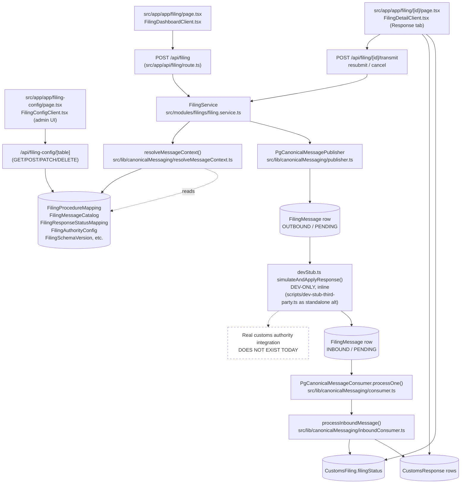

# Customs Filing — Canonical Messaging Architecture

This document is a technical reference for the async, country-agnostic messaging
layer that sits between the Customs Filing module's UI/API and "the outside
world." It complements `docs/backend-architecture.md` (the general layered
architecture) and `docs/customs-filing-canonical-messaging-changelog.md` (the
narrative build history); this file describes the resulting system as it
stands today, grounded in file:line citations.

## 1. Component map



The dashed box is deliberate: no code path today transforms the canonical
JSON into a real authority's wire format or talks to an external network
endpoint. Everything left of "FilingMessage OUTBOUND" is real production
code; everything from the dev stub onward exists only to make the loop
exercisable in development (see Section 4).

## 2. Message routing logic

`resolveMessageContext()` (`src/lib/canonicalMessaging/resolveMessageContext.ts:25-77`)
is "the single resolution point" for `country`, `procedure`, `messageName`,
and `queueName` — no caller is permitted to hardcode any of these.

Step by step:

1. **Normalize the entry type.** `requireEntryTypeCode(input.entryType)`
   (`resolveMessageContext.ts:29`) canonicalizes whatever free-text or coded
   value is stored on the shipment (e.g. `"Consumption Entry"`, `"01"`, `"01 -
   CONSUMPTION ENTRY"`) into a stable internal code such as `"01"`
   (`src/modules/filing/entryType.ts:21`). This vocabulary is treated as
   fixed, legally-defined CBP terminology and is kept as TypeScript, not a
   database table.
2. **Require a destination country.** `input.destinationCountry` must already
   be set on the shipment; it is never inferred (`resolveMessageContext.ts:31-37`).
3. **Resolve the procedure code.** Queries `FilingProcedureMapping` for rows
   matching `entryType` exactly and `country` equal to either the real
   country or the wildcard `"*"` (`resolveMessageContext.ts:39-42`), then
   picks the most specific match via `findMostSpecificMatch()`.
4. **Resolve the message name / queue.** Queries `FilingMessageCatalog` for
   rows matching `action`, `country`, and `procedureCode`, each independently
   allowed to be `"*"` (`resolveMessageContext.ts:51-62`), and again picks the
   most specific match.
5. **Fail closed.** Any unmapped combination throws a descriptive error
   rather than silently defaulting (`resolveMessageContext.ts:43-48, 63-68`).

`findMostSpecificMatch()` (`src/lib/canonicalMessaging/wildcardLookup.ts:10-37`)
implements "most-specific-wins": for each candidate row it counts how many of
the given fields matched a real (non-`"*"`) value; a row disqualifies itself
if any non-wildcard field mismatches; among rows that do match, the one with
the highest count of real-value matches wins. A country-specific row with two
real fields always beats a wildcard row with zero.

**Example trace — US consumption entry, SUBMIT action:**

- Shipment has `entryType = "Consumption Entry"`, `destinationCountry = "US"`.
- `requireEntryTypeCode` normalizes `"Consumption Entry"` → `"01"`
  (`entryType.ts:21`).
- `FilingProcedureMapping` lookup for `(entryType: "01", country: "US")` finds
  a US-specific row (score 1) beating any `"*"` fallback if both existed;
  returns e.g. procedure `"01"` for the US case (contrast with DE, where
  `"01"` maps to CPC `"4000"` per the 2026-08-12 changelog entry).
- `FilingMessageCatalog` lookup for `(action: "SUBMIT", country: "US",
  procedureCode: "01")` against catalog rows that were generalized to
  `country: "*"` (per the same changelog entry, since message names like
  `CUSTOMS_DECLARATION_SUBMIT` don't vary by destination) resolves via the
  wildcard row, returning `messageName: "CUSTOMS_DECLARATION_SUBMIT"` and its
  `queueName`.
- Result: `{ entryTypeCode: "01", country: "US", procedure: "01", messageName:
  "CUSTOMS_DECLARATION_SUBMIT", queueName: <catalog value> }`.

## 3. Queue mechanics

`FilingMessage` (`prisma/schema.prisma:3882-3914`) is simultaneously the
durable audit log and the outbound/inbound queue — there is no separate
queue table. Relevant columns: `direction` (`OUTBOUND`/`INBOUND`),
`queueStatus` (`PENDING`, `CLAIMED`, `PROCESSED`, `FAILED`), `lockedAt`,
`attempts`, `errorMessage`, `envelope` (the full header+data JSON, the
audit source of truth).

**Outbound (publish).** `PgCanonicalMessagePublisher.publish()`
(`src/lib/canonicalMessaging/publisher.ts:18-42`) validates the header and
declaration against the active JSON Schemas, then does a single
`db.filingMessage.create()` with `direction: "OUTBOUND"`, `queueStatus:
"PENDING"`. No provider SDK call happens here — publishing just means
"durably persist, ready to be claimed."

**Inbound (claim).** `PgCanonicalMessageConsumer.processOne()`
(`src/lib/canonicalMessaging/consumer.ts:25-71`) claims exactly one row at a
time with a raw SQL statement:

```sql
UPDATE "FilingMessage"
SET "queueStatus" = 'CLAIMED', "lockedAt" = NOW()
WHERE id = (
  SELECT id
  FROM "FilingMessage"
  WHERE "direction" = 'INBOUND'
    AND ("queueStatus" = 'PENDING' OR ("queueStatus" = 'CLAIMED' AND "lockedAt" < NOW() - INTERVAL '5 minutes'))
  ORDER BY "createdAt" ASC
  FOR UPDATE SKIP LOCKED
  LIMIT 1
)
RETURNING id, envelope, attempts;
```

(`consumer.ts:28-41`). `FOR UPDATE SKIP LOCKED` lets multiple worker
processes/instances poll concurrently without blocking on each other's
in-flight claims. The `lockedAt < NOW() - INTERVAL '5 minutes'` clause lets a
row that was claimed but never finished (e.g. a crashed worker) be re-claimed
after 5 minutes — the same stale-claim window used by `PgQueue` elsewhere in
the codebase (`consumer.ts:12,17`).

**Process and mark.** After claiming, the row's `envelope` is re-validated
against the active `ENVELOPE_HEADER` and `FILING_RESPONSE_DATA` schemas, then
handed to the caller's `handler` (`consumer.ts:47-51`). On success the row is
marked `PROCESSED` with `processedAt` and `status` set from the message data
(`consumer.ts:53-56`). On any thrown error — schema validation failure or a
handler exception — the row is marked `FAILED` with `errorMessage` set and
`attempts` incremented, then the error is re-thrown (`consumer.ts:57-68`).

**No retry, no backoff, no dead-letter queue.** `attempts` is incremented on
failure but nothing ever reads it to decide whether to retry, wait, or give
up — there is no backoff schedule and no automatic re-queue of a `FAILED`
row. A row that lands in `FAILED` simply stays there; the only way it moves
again is manual intervention (e.g. a human or script resetting its
`queueStatus` back to `PENDING`). `consume()` (`consumer.ts:80-89`) just
loops `processOne()` until nothing is left to claim — draining, not
retrying.

`drainInboundQueue()` (`src/lib/canonicalMessaging/inboundConsumer.ts:132-139`)
and the standalone worker `scripts/customs-filing-inbound-worker.ts:13-30`
both wrap `processOne()`/`consume()` this same way — the worker just polls
every 2 seconds (`POLL_INTERVAL_MS = 2000`, line 11) when nothing is pending,
with no exponential backoff on repeated empty polls either.

## 4. Integration points with customs authorities and external services

**There is no real customs-authority integration today.** This is the current
factual state, not a criticism of the design — the architecture (queue table,
publisher/consumer interfaces, canonical schema) is explicitly built so a real
integration can be swapped in later without changing callers.

What exists instead is `src/lib/canonicalMessaging/devStub.ts`, explicitly
labeled dev-only in its own doc comment (`devStub.ts:1-21`):

- `simulateThirdPartyResponse(outboundMessageId)` (`devStub.ts:22-81`) reads
  back the single just-published `OUTBOUND`/`PENDING` `FilingMessage` row
  matching `outboundMessageId`, synthesizes an `INBOUND` response inline
  (`ACCEPTED` for most actions, `CANCELLED` for a `CANCELLATION` message,
  `devStub.ts:29,46-55`), marks the outbound row `PROCESSED`, and writes the
  new inbound row — all inside one `db.$transaction` (`devStub.ts:58-78`).
  The response payloads are explicit about what they are: `"[DEV STUB]
  Simulated acceptance -- no real authority transmission occurred."`
  (`devStub.ts:54`).
- `simulateAndApplyResponse(outboundMessageId)` (`devStub.ts:84-92`) is the
  function actually wired into the transmit/resubmit/cancel routes
  (`src/app/api/filing/[id]/transmit/route.ts:135`,
  `.../resubmit/route.ts:38`, `.../cancel/route.ts:49`). It answers the
  message, then immediately drains the inbound queue via a fresh
  `PgCanonicalMessageConsumer`, so the Response tab populates synchronously
  within the same request instead of requiring a human to run a script.
  Gated by `CUSTOMS_FILING_MOCK_RESPONSES` (default on; set to the literal
  string `"false"` to disable, `devStub.ts:85`) — the documented "single,
  visible switch to flip off once a real integration exists."
- `scripts/dev-stub-third-party.ts` is a standalone alternative to the inline
  path: run by hand (`npx tsx scripts/dev-stub-third-party.ts`), it drains
  *all* pending `OUTBOUND` rows across the whole database and always answers
  `ACCEPTED` (`dev-stub-third-party.ts:19-75`), regardless of message type —
  unlike the inline stub it does not special-case `CANCELLATION`.
- `scripts/customs-filing-inbound-worker.ts` is the standalone long-running
  process that would, in a real deployment, replace the inline
  `simulateAndApplyResponse()` call: it polls `FilingMessage` for `INBOUND`/
  `PENDING` rows exactly the way `PgCanonicalMessageConsumer` is designed to
  be polled, forever, on a 2-second interval.

**What is genuinely missing for a real integration:** any code that renders
the canonical JSON declaration into an authority's wire format (EDIFACT, ANSI
X12, a country-specific XML schema, etc.), and any code that opens an actual
network connection (SFTP, AS2, SOAP, REST) to a customs authority or an
EDI/VAN intermediary. `CanonicalMessagePublisher`/`CanonicalMessageConsumer`
are defined as interfaces precisely so such an adapter could be added later
as a new class (`publisher.ts:5-7`, `consumer.ts:5-10`) without touching
`FilingService` or the routes that call it — but that adapter does not exist
in this codebase today.

## 5. API surface

| Method | Path | Purpose |
|---|---|---|
| GET | `/api/filing` | Search/filter/paginate the account's `CustomsFiling` records with computed metrics (`src/app/api/filing/route.ts:11-294`). |
| POST | `/api/filing` | Create a new Draft filing for a shipment; fails closed if `destinationCountry`, a `FilingProcedureMapping`, or a `FilingAuthorityConfig` row is missing; generates a neutral internal entry number (`route.ts:305-478`). |
| GET | `/api/filing/[id]` | Full filing detail: snapshot-preferring line items, documents, responses, timeline, audit trail, related filings (`[id]/route.ts:12-219`). |
| PATCH | `/api/filing/[id]` | Limited field update (e.g. `dutyBreakdown`); explicitly rejects any attempt to set `filingStatus`/`paymentStatus` directly, forcing status changes through the state machine (`[id]/route.ts:221-272`). |
| POST | `/api/filing/[id]/approve` | Applies the `broker.approve` transition (`ReadyForBrokerReview` → `BrokerApproved`) (`approve/route.ts:19-67`). |
| POST | `/api/filing/[id]/validate` | Runs `runFilingValidation()` and advances the state machine via `validate.pass`/`validate.fail` when the transition is legal (`validate/route.ts:14-123`). |
| POST | `/api/filing/[id]/transmit` | Re-runs server-side validation, calls `FilingService.transmitFiling()` to publish the `SUBMIT` message, then (dev-only) applies the mock response inline (`transmit/route.ts:18-173`). |
| POST | `/api/filing/[id]/resubmit` | Calls `FilingService.resubmitFiling()` to rebuild and publish a `RESUBMIT` message from the shipment's current data (`resubmit/route.ts:14-69`). |
| POST | `/api/filing/[id]/cancel` | Calls `FilingService.cancelFiling()` to publish a `CANCELLATION` referencing the last outbound message; applies `cancel.request` only (`cancel/route.ts:18-84`). |
| GET | `/api/filing/[id]/entry-summary` | Builds/returns a CBP Form 7501 entry summary (JSON or PDF via `?format=pdf`) from the filing's line items and duty calculation (`entry-summary/route.ts:12-142`). |
| GET | `/api/filing/[id]/action-fields` | Read-only: resolves the prompted-field requirements for a given action (`SUBMIT`/`AMENDMENT`/`CANCELLATION`/`RESUBMIT`/`STATUS_INQUIRY`) so a confirmation modal can render prompts before submitting (`action-fields/route.ts:20-48`). |
| GET | `/api/filing-config/[table]` | Platform-admin-only: list rows of one of the global filing config tables (`FilingProcedureMapping`, `FilingMessageCatalog`, etc.) (`filing-config/[table]/route.ts:22-32`). |
| POST | `/api/filing-config/[table]` | Platform-admin-only: create a config row (`filing-config/[table]/route.ts:34-55`). |
| PATCH | `/api/filing-config/[table]/[id]` | Platform-admin-only: update a config row (`filing-config/[table]/[id]/route.ts:16-40`). |
| DELETE | `/api/filing-config/[table]/[id]` | Platform-admin-only: delete a config row (`filing-config/[table]/[id]/route.ts:42-60`). |

Note: the `filing-config` routes are gated by `ctx.isPlatformAdmin`
(`filing-config/[table]/route.ts:15-20`) rather than a per-tenant permission,
since these tables are shared, global configuration, not account-scoped data.

## 6. Service/module dependency list

- **`FilingService`** (`src/modules/filings/filing.service.ts`) depends on:
  `filingStateMachine.ts` (`applyTransition`), `declarationBuilder.ts`
  (`buildCanonicalDeclaration`), `resolveMessageContext.ts`, `publisher.ts`
  (`PgCanonicalMessagePublisher`), `schemaValidator.ts`
  (`getActiveSchemaVersion`), `actionDataRequirements.ts`
  (`buildActionExtensions`), `dutyEngine.ts` (`computeFilingTariff`,
  `loadHtsCodesMap`) (`filing.service.ts:1-10`).
- **`resolveMessageContext.ts`** depends on `entryType.ts`
  (`requireEntryTypeCode`) and `wildcardLookup.ts` (`findMostSpecificMatch`)
  (`resolveMessageContext.ts:2-3`).
- **`publisher.ts`** depends on `schemaValidator.ts`
  (`validateAgainstActiveSchema`) (`publisher.ts:2`).
- **`consumer.ts`** depends on `schemaValidator.ts`
  (`validateAgainstActiveSchema`, `SchemaValidationError`) (`consumer.ts:2`).
- **`inboundConsumer.ts`** depends on `filingStateMachine.ts`
  (`applyTransition`, `FilingTransitionError`), `wildcardLookup.ts`
  (`findMostSpecificMatch`), `consumer.ts` (`PgCanonicalMessageConsumer`),
  and (outside canonical messaging) `DrawbackService` for creating drawback
  lots on acceptance (`inboundConsumer.ts:1-6, 77`).
- **`devStub.ts`** depends on `consumer.ts` (`PgCanonicalMessageConsumer`)
  and `inboundConsumer.ts` (`processInboundMessage`) (`devStub.ts:2-3`).
- **API routes** (`transmit`, `resubmit`, `cancel`) depend on `FilingService`
  and `devStub.ts` (`simulateAndApplyResponse`) directly
  (`transmit/route.ts:8-9`, `resubmit/route.ts:8-9`, `cancel/route.ts:7-8`).
- **`schemaValidator.ts`** depends only on `db` (`FilingSchemaVersion`) and
  `ajv` — no dependency on other canonical-messaging modules
  (`schemaValidator.ts:1-2`).

Note: `filingActionRules.ts` (`resolveAllowUpdates()`) and
`childActionRules.ts` (`resolveChildActions()`) are adjacent, UI-gating
modules referenced in the changelog but out of scope for this document's
source review — they govern edit/action-button visibility, not the
outbound/inbound message lifecycle itself.
