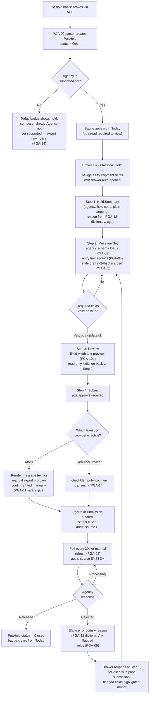
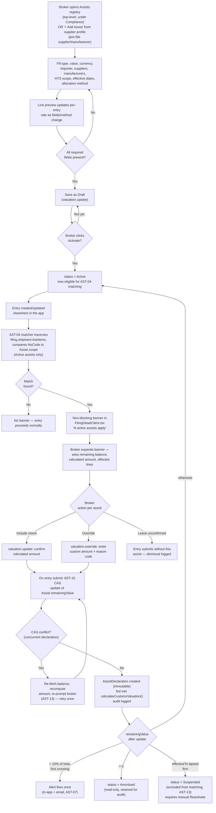

# PGA Holds & Assists

**Status:** Draft — gap review applied · **Date:** 2026-09-01 · **Audience:** Engineering · Design · **Triggered by:** Broker feedback

> **Read first — verified against the current codebase**
>
> This spec has been checked against the actual repo three times: once for coverage gaps, once to replace prose with exact schemas/signatures, once to add API contracts and full step-by-step user flows. Everything below matches what's really in this repo today, not what a first-draft PRD assumed.
>
> - **ABI transmission is not live, and there's no feature-flag system to gate it with.** The PGA message-set wire-format codec exists (`apps/custom/src/lib/abi/pgaMessageSet/`) but has zero callers — `RealAceProvider.transmit()`/`getStatus()` are stub throws, and what's actually wired in production is `MockCustomsTransmissionProvider`. There's no GrowthBook/LaunchDarkly/env-flag mechanism anywhere in this repo. PGA-11 routes through the existing provider-selection seam instead of inventing one, and explicitly guards against silently faking a successful federal filing against Mock.
> - **"Work Queue" is stale terminology.** The Navigation IA redesign renamed this view to **Today** (`/app/actions`). All references below use Today.
> - **PGA/assist data models are partial, not absent — and reusing them wrong would be worse than building fresh.** `PgaRequirement` is pre-clearance risk screening, not a real hold; `ValuationAssistsRecord` is one loose JSON blob per filing, not an account-level ledger. PGA-10 and AST-08 give the exact new Prisma models needed and exactly how they reconcile with what exists.
> - **Permissions: mostly already exist.** The `PGA` and `Valuation` permission categories were evidently built with this feature in mind (`pga.approve`'s description is literally "Approve PGA message set for transmission"; `valuation.update`'s is literally "Modify entered values and assists"). PGA-13 and AST-12 map straight onto existing rows — at most one new row across both features.
> - **Rounding, concurrency, and tenant isolation cite the exact existing patterns to copy** — `roundToCents()`, the optimistic-lock CAS pattern from `utilizationService.ts`, and the `billing-tenant-isolation.test.ts` test shape.
> - **API contracts, a file map, and full step-by-step user flows (with diagrams)** are included per feature: real route paths against the confirmed `withAuthenticatedRoute` convention, exact files to create vs. modify, and every checkpoint/branch a broker or the system hits end to end.
> - **Out of scope, by design:** proactive PGA-by-HTS screening (knowing a hold is coming *before* CBP issues one) is a separate, upstream problem — `HtsPgaRequirement` has zero real rows today and live screening covers only 3 of these 6 agencies via keyword heuristics. Feature 1 here is the reactive counterpart (resolving a hold once issued). See the companion spec: [`PGA-HTS-SCREENING-AND-REFERENCE-DATA.md`](./PGA-HTS-SCREENING-AND-REFERENCE-DATA.md).

---

# Feature 1 — PGA Hold Resolution — Message Set Composer

`Feature 1` · `P0`

When CBP issues a PGA (Partner Government Agency) hold on a shipment, the filer must compose and transmit a structured electronic message set — agency-specific data fields — through ACE to satisfy the agency's intake requirements. Today Qubere surfaces the hold but provides no interface to compose or submit the message set, forcing brokers to exit the app. This feature closes that gap.

**Agencies in scope:** FDA · USDA/APHIS · EPA · FWS · CPSC · NHTSA. Initial scope covers the six most common agencies. TTB, BATFE, and OFAC in a subsequent sprint.

## User Stories

- As a **licensed customs broker**, when I open a PGA-held shipment in Today, I want to immediately see which agency holds it, the hold reason code, and what data they require — without switching to a separate ACE portal window.
- As a **broker**, I want to compose the required PGA message set fields directly in the app with pre-population from the existing entry data, so I'm not re-typing information Qubere already knows.
- As a **broker**, I want to submit the completed message set to ACE and see real-time status (submitted → accepted or rejected) tracked in the shipment timeline.
- As a **broker**, when a message set is rejected by the agency, I want to see the specific rejection reason and which fields to correct — then re-submit without starting over.
- As a **broker manager**, I want to see all shipments with open PGA holds in a filterable view so I can prioritize by agency, age, and importer.

## Functional Requirements

### Hold Detection & Display

**PGA-01 — Surface PGA holds in Today** `P0`
Shipments with one or more open PGA holds display a color-coded agency badge in the Today view (`/app/actions`). Multiple holds on one shipment display stacked badges. Today can be filtered by hold agency and sorted by hold age.

**PGA-02 — Parse CBP hold notification into structured data** `P0`
Ingest the CBP-issued 1A hold notice from ACE and extract: agency code, hold reason code, commodity line reference, and timestamp. Map to a human-readable explanation using the CBP hold code dictionary. **No existing code does this.** `apps/custom/src/lib/abi/pgaMessageSet/parse.ts` only exports `classifyPgaMessageSetLine(line: string)`, which classifies the record type of an *outbound* message-set line (PG01, OI, ...) — it does not parse an *inbound* 1A hold notice. This is a net-new parser to write, most naturally alongside the existing inbound-message handling in the filing/ACE ingestion path, since `pgaMessageSet/` is outbound-only today.

### Message Set Composition

**PGA-03 — Agency-aware form schema loader** `P0`
On opening the composer for a given hold, load the correct field schema for that agency. FDA loads Prior Notice fields; USDA/APHIS loads Lacey Act or phytosanitary certificate fields; EPA loads TSCA or vehicle compliance fields; FWS loads wildlife declaration fields; CPSC loads certificate of compliance fields; NHTSA loads vehicle safety compliance fields.

**PGA-04 — Pre-fill from entry data** `P0`
Fields derivable from the existing entry (importer of record, manufacturer, country of origin, commodity description, HTS, quantity, unit of measure, port of entry) are pre-populated and marked with a "from entry" provenance chip. Pre-filled values are editable.

**PGA-05 — Inline validation, no submit-to-fail** `P0`
Required fields validate as the broker types or leaves focus. The submit action is disabled until all required fields pass. Agency-specific format rules (e.g. FDA product code format, USDA species scientific name) are enforced inline with the exact correction hint from the agency spec.

**PGA-06 — Power-user transmission preview** `P1`
A collapsible "Review transmission" panel shows the exact ABI/ACE formatted message that will be sent. Read-only; edits go back through the form. **Correction: this is not JSON.** Each `build*()` function in `apps/custom/src/lib/abi/pgaMessageSet/build.ts` (e.g. `buildPg01Header`, `buildOiLineItem`) returns a fixed-width text record string, not a structured object — the "message set" is the concatenation of these record strings in the order the agency's spec requires. The preview panel renders that concatenated fixed-width text (monospaced, one record per line), not a JSON tree. See PGA-10a for the orchestration function that needs to be written to produce it — no code currently calls these builders outside of tests.

### Submission & Status

**PGA-07 — Transmit via ABI transport layer** `P0`
Submit the composed message set to ACE through the ABI transmission infrastructure. Track the submission with a timestamp and operator identity. Do not allow duplicate submission of the same message set. **Blocked on live transport — see PGA-11.** The wire-format codec that builds/parses/validates this payload already exists (`apps/custom/src/lib/abi/pgaMessageSet/`); what's missing is the transmission call itself.

**PGA-08 — Real-time status polling** `P0`
After submission, poll ACE for the agency response at 30-second intervals. Display a live status indicator: **Submitted → Processing → Released** or **→ Rejected**. Broker can manually trigger a refresh. Status is recorded in the shipment audit timeline. Same live-transport dependency as PGA-07 — see PGA-11.

**PGA-09 — Rejection handling with correction flow** `P0`
On agency rejection, display the response code, the plain-language reason (from the agency's code table), and highlight the specific field(s) that caused rejection. The broker re-enters the form pre-populated with their prior submission, corrects only the flagged fields, and re-submits. No data is lost.

### Dependencies, Data Model & Access Control

**PGA-10 — New data entity: PgaHold (do not reuse PgaRequirement)** `P0`

`PgaRequirement` (schema.prisma) is a pre-clearance risk-screening row keyed to a `shipmentLineItem`, with a `holdRisk` string ("High"/"Medium"/"Low") — it is not a real CBP hold and has no status lifecycle. Add a new model instead:

```prisma
model PgaHold {
  id                String    @id @default(cuid())
  accountId         String
  account           Account   @relation(fields: [accountId], references: [id], onDelete: Cascade)
  shipmentId        String
  shipment          Shipment  @relation(fields: [shipmentId], references: [id], onDelete: Cascade)
  agencyCode        String    // FDA | USDA | EPA | FWS | CPSC | NHTSA
  holdCode          String    // CBP 1A hold reason code, e.g. "47-B"
  status            String    @default("Open") // Open | Submitted | Processing | Released | Rejected | Closed
  commodityLineRef  String?
  issuedAt          DateTime
  closedAt          DateTime?
  version           Int       @default(0)
  draftFormInput    Json?     // in-progress composer state, see PGA-10b
  draftUpdatedAt    DateTime?
  createdAt         DateTime  @default(now())
  submissions       PgaHoldSubmission[]

  @@index([accountId])
  @@index([shipmentId])
  @@index([status])
}

model PgaHoldSubmission {
  id             String   @id @default(cuid())
  pgaHoldId      String
  pgaHold        PgaHold  @relation(fields: [pgaHoldId], references: [id], onDelete: Cascade)
  idempotencyKey String   @unique // see PGA-14
  messageSetText String   // concatenated fixed-width record output
  formInputJson  Json     // structured Pg##Input values, for re-opening the form on correction
  status         String   @default("Sent") // Sent | Accepted | Rejected
  rejectionCode  String?
  rejectionReason String?
  operatorUserId String
  submittedAt    DateTime @default(now())
}
```

Migration filename following repo convention (`YYYYMMDDHHMMSS_snake_case`, e.g. `packages/db/prisma/migrations/20260831200000_onboarding_account_relations`): `<timestamp>_add_pga_hold_resolution`. `PgaRequirement` is untouched — it continues to drive which agencies/fields a shipment is screened against; `PgaHold` is the actual hold and its submission history.

**PGA-10a — New orchestration layer: composeMessageSet()** `P0`

`apps/custom/src/lib/abi/pgaMessageSet/` is a low-level per-record builder library with no caller in application code today (only tests exercise it). Write a new function, e.g. `apps/custom/src/lib/abi/pgaMessageSet/composeMessageSet.ts`:

```ts
export function composeMessageSet(
  agencyCode: string,
  formInput: PgaAgencyDataPayload,   // the structured form values from PGA-03/04
): { messageSetText: string; recordsUsed: string[] } {
  // 1. select which build*(...) functions apply for this agencyCode
  // 2. map formInput fields into each Pg##Input shape
  // 3. call each build*(...) -> fixed-width record string
  // 4. concatenate in agency-spec-required order, return the text + which records were used
}
```

This is what PGA-06's preview panel renders, and what `PgaHoldSubmission.messageSetText` stores. Field-to-record mapping must be authored per agency alongside the field matrices below — that authoring work (product + a licensed CHB) is a hard prerequisite for this function, not just for the field-matrix tables.

**PGA-10b — Draft persistence** `P1`

No "autosave with expiry" precedent exists in this codebase. Existing "Save Draft" features (`FilingDetailClient.tsx`, `FilingNewClient.tsx`) persist a draft field permanently with no TTL. Use the `draftFormInput`/`draftUpdatedAt` columns added to `PgaHold` in PGA-10, plus read-time staleness logic modeled on how `ActionsClient.tsx` derives an expiry countdown from `createdAt + severityHours` at render time (not a stored `expiresAt`): on opening the composer, if `now - draftUpdatedAt > 24h`, treat the draft as empty (start from entry pre-fill again per PGA-04) even though the row isn't deleted.

**PGA-10c — New component required: no drawer primitive exists** `P1`

This app has no Radix, shadcn, or any Sheet/Drawer component — confirmed via `package.json`. The only dialog primitive is `apps/custom/src/components/ui/Modal.tsx` (`Modal`/`ModalHeader`/`ModalBody`/`ModalFooter`), and it's a *centered* dialog, not right-anchored. The right-anchored drawer in the UX Spec below is **net-new UI work**. Build a sibling component, e.g. `apps/custom/src/components/ui/DrawerShell.tsx`, reusing the same `useDialogFocus` hook (`@/lib/useDialogFocus`) that `Modal.tsx` already uses, but with slide-in-from-right / full-height styling. For the 4-step internal navigation, the closest precedent is `apps/custom/src/app/app/shipments/[id]/LineItemDetailTabsModal.tsx` (multi-tab content inside a modal).

**PGA-11 — Transmission path: no feature-flag utility exists, use the provider seam instead** `P0`

No feature-flag mechanism exists anywhere in this repo (checked GrowthBook, LaunchDarkly, env-based toggles, a `flags.ts`). Don't invent one. Filing transmission already goes through a swappable interface:

```ts
// apps/custom/src/lib/filing/transmissionProvider.ts
export interface CustomsFilingTransmissionProvider {
  transmit(payload: AbiPayload): Promise<TransmissionResult>;
  getStatus(referenceNumber: string): Promise<FilingStatusUpdate>;
  parseAcknowledgment(raw: string): AcknowledgmentResult;
}
```

`MockCustomsTransmissionProvider` (`apps/custom/src/lib/providers/index.ts`) is what's actually wired in production today; `RealAceProvider.transmit()`/`getStatus()` are literal stub throws. PGA-07/08 should call the same provider-selection path everything else in filing uses — **do not build a PGA-specific transport call.** That said: routing a real hold submission through `MockCustomsTransmissionProvider` would silently fabricate a fake "Accepted" status for what the broker believes is a real federal filing — this org has treated fabricated-compliance-data bugs as P0 before. So PGA-07's "Submit" action must explicitly check which provider is active and refuse to claim success against Mock: when the active provider is Mock, "Submit" instead renders the composed `messageSetText` for the broker to copy and file manually through their existing ACE channel, and records the `PgaHoldSubmission` row with `status: "Sent"` but a note that transmission was manual. When `RealAceProvider` is later completed and swapped in, PGA-07/08 work with no PGA-specific code change.

**PGA-12 — CBP hold-code reference dictionary** `P0`

No hold-code table exists yet. Mirror the exact shape already used for the ABI condition-code dictionary (`apps/custom/src/lib/abi/errorDictionary.ts`):

```ts
export interface HoldCodeEntry {
  agencyCode: string;
  holdCode: string;
  narrativeText: string;
  explanation: string;
}
export const PGA_HOLD_CODE_DICTIONARY_ROWS: readonly HoldCodeEntry[] = [ /* ... */ ];
export function getHoldCodeEntry(agencyCode: string, holdCode: string): HoldCodeEntry | undefined { /* ... */ }
```

New file: `apps/custom/src/lib/abi/holdCodeDictionary.ts`, alongside `errorDictionary.ts` and `governmentAgencyCodes.ts`.

**PGA-13 — Permissions: reuse the existing PGA category, no new rows needed** `P0`

`packages/auth/src/permissions.ts` already has a `PGA` category that was evidently designed with this exact feature in mind — `pga.approve`'s description reads *"Approve PGA message set for transmission"* verbatim:

```ts
{ name: "pga.read",    description: "View PGA message set requirements.",       category: "PGA", ... }
{ name: "pga.update",  description: "Update PGA program data.",                  category: "PGA", ... }
{ name: "pga.review",  description: "Review PGA validation warnings.",           category: "PGA", ... }
{ name: "pga.approve", description: "Approve PGA message set for transmission.", category: "PGA", ... }
```

Map directly: `pga.read` gates viewing hold badges in Today and opening the composer read-only; `pga.update` gates editing message-set fields and saving drafts; `pga.review` gates the broker-manager filtered view; `pga.approve` gates the Submit action. **Do not add new `pga.hold.*` permission rows.**

**PGA-14 — Idempotency key & failure handling** `P1`

Don't hand-roll this — `apps/custom/src/lib/api/idempotency.ts` already provides `checkIdempotency`/`persistIdempotency`, and `apps/custom/src/app/api/filing/[id]/validate/route.ts` is the exact precedent for a state-changing route using it. The submit route should call `checkIdempotency` on the client-supplied idempotency key at the top of the handler — this is the primary guard. `PgaHoldSubmission.idempotencyKey` (unique-constrained) is a defense-in-depth backstop at the DB layer, computed as a hash of `(pgaHoldId, messageSetText, submissionAttemptNumber)`. Define retry/backoff behavior when transmission times out or errors before any agency response is received (distinct from an agency Rejection) — surface as a transient "Transmission failed — retry" state, not Rejected. Define the fallback UX for agencies outside the six supported: the hold still surfaces in Today, but the composer shows "Agency not yet supported — export raw hold notice."

## UX Spec

The resolution flow lives entirely within the shipment context — no page navigations, no new tabs. A right-anchored drawer opens over the shipment detail, preserving the broker's context (entry data, timeline, documents) behind it.

**UX sketch — Today, PGA hold indicators.** Queue rows show a color-coded agency badge (stacked for multiple holds) and a "Resolve Hold →" button. Agency badges are color-coded; age in days makes urgency scannable at a glance.

**UX sketch — Message Set Composer, 4-step drawer.** Step indicator: 1 Hold Summary → 2 Message Set → 3 Review → 4 Status. The hold banner shows agency, hold code, plain-language reason, and age. Fields are grouped by agency section, with a "from entry" chip on pre-filled fields and a required-field counter per group. Continue is disabled until all required fields in the current group are valid.

> The drawer never navigates away from the shipment. The broker can see the entry data, document panel, and timeline behind the drawer at all times. On mobile (<768px), the drawer takes full width.

## User Flow — every checkpoint

The happy path is four steps. The value here is the branches: what happens at each checkpoint when something isn't clean.



1. **Detection.** ACE delivers a 1A hold notice → the new parser (PGA-02) creates a `PgaHold` row, status `Open`. If the agency isn't one of the six supported, the badge still appears but the composer is replaced with an export-only state (PGA-14).
2. **Discovery.** Badge shows in Today, gated by `pga.read`. Clicking "Resolve Hold" is the one navigation in this flow — from Today to the shipment detail page, drawer auto-opened. Every following step happens inside that drawer with no further navigation.
3. **Compose.** Step 2 loads the agency's field schema and pre-fills what the entry already knows. If a draft exists and is under 24h old, it's restored; otherwise the form starts from entry pre-fill again. Continue is blocked until required fields pass inline validation.
4. **Review.** Step 3 is read-only — the exact fixed-width text that will be sent. Any correction routes back to Step 2.
5. **Submit.** The branch that matters most: which transport provider is live. Against Mock, the broker gets the composed message text to file manually and explicitly confirms they did — the system never claims a federal filing succeeded when it didn't.
6. **Track.** Status polling is a background/automated write (`source: "SYSTEM"`), distinct from the broker's own actions (`source: "UI"`).
7. **Resolve or correct.** Released closes the hold and clears the badge. Rejected reopens the composer pre-filled with the prior submission and highlights only the fields the agency flagged.

## Field Matrix — FDA Prior Notice (example)

Full matrices for all six agencies to be authored by product in collaboration with a licensed CHB. This table illustrates the pattern.

| Field ID | Label | Required | Pre-fill source | Format / validation |
|---|---|---|---|---|
| `FDA_FIRM_NAME` | Manufacturer firm name | Yes | Entry manufacturer field | Free text, max 200 chars |
| `FDA_FIRM_COUNTRY` | Country of manufacture | Yes | Entry country of origin | ISO 2-letter code |
| `FDA_PRODUCT_CODE` | FDA product code | Yes | — | 7-char alphanumeric, validated against FDA product code list |
| `FDA_INTENDED_USE` | Intended use code | Yes | — | Enum: HUMAN_FOOD, ANIMAL_FEED, DRUG, COSMETIC, DEVICE |
| `FDA_QUANTITY` | Quantity | Yes | Entry line item quantity | Numeric, must match entry quantity |
| `FDA_UOM` | Unit of measure | Yes | Entry UOM | FDA UOM code list |
| `FDA_LOT_NUMBER` | Lot / batch number | If perishable | — | Free text; conditional on product code class |
| `FDA_ARRIVAL_DATE` | Anticipated arrival date | Yes | Entry estimated arrival | ISO 8601 date |

## API & File Map

Every route follows the existing `withAuthenticatedRoute` wrapper (`apps/custom/src/lib/api/auth-guards.ts`) — permission and account-scoping are declared, not hand-coded, exactly like `apps/custom/src/app/api/filing/[id]/validate/route.ts` and `apps/custom/src/app/api/pga/screen/route.ts`. Errors throw a `DomainError` subclass and let the wrapper's shared `handleApiError` format the response.

| Route | Method | Permission | Notes |
|---|---|---|---|
| `/api/pga/holds` | GET | `pga.read` | Today badge data + manager filtered view (filter by agency/age) |
| `/api/pga/holds/[id]` | GET | `pga.read` | Hold detail + schema + restored draft if <24h |
| `/api/pga/holds/[id]/draft` | PATCH | `pga.update` | Writes `draftFormInput` + `draftUpdatedAt` |
| `/api/pga/holds/[id]/submit` | POST | `pga.approve` | Idempotency-Key header via `checkIdempotency`/`persistIdempotency`; composes via PGA-10a, routes through PGA-11's provider check |
| `/api/pga/holds/[id]/status` | GET | `pga.read` | Manual refresh; polling hits the same route every 30s client-side |

**Files to create**
- `packages/db/prisma/migrations/<timestamp>_add_pga_hold_resolution/` — PGA-10 schema
- `apps/custom/src/lib/abi/pgaMessageSet/composeMessageSet.ts` — PGA-10a
- `apps/custom/src/lib/abi/holdCodeDictionary.ts` — PGA-12
- `apps/custom/src/lib/abi/inboundHoldNoticeParser.ts` (or alongside wherever entry acknowledgments are currently ingested) — PGA-02's inbound parser
- `apps/custom/src/components/ui/DrawerShell.tsx` — PGA-10c
- `apps/custom/src/app/app/shipments/[id]/PgaHoldResolutionDrawer.tsx` — the 4-step composer
- `apps/custom/src/app/api/pga/holds/` — the five routes above

**Files to modify**
- `apps/custom/src/app/app/actions/ActionsClient.tsx` (Today) — add agency badge + "Resolve Hold →" trigger per queue row
- Shared `AuditAction` enum — add `PGA_HOLD_SUBMITTED`, `PGA_HOLD_STATUS_UPDATED`, `PGA_HOLD_REJECTED`

## Acceptance Criteria

- [ ] Today surfaces PGA holds with agency badge; filterable by agency and hold age.
- [ ] "Resolve Hold" opens a right-anchored drawer without page navigation; closing preserves all draft state for 24 hours.
- [ ] Composer loads the correct field schema for each of the six supported agencies.
- [ ] Fields derivable from the existing entry are pre-populated and marked with a provenance chip.
- [ ] Inline validation fires on field blur; required-field violations block the Continue action.
- [ ] Message set transmission is idempotent via `PgaHoldSubmission.idempotencyKey` (unique-constrained); a duplicate submission attempt is rejected at the DB layer.
- [ ] Submit checks which `CustomsFilingTransmissionProvider` is active; against Mock, it renders the composed message-set text for manual export instead of claiming a fake "Accepted."
- [ ] Status polling updates at ≤60s intervals; Released and Rejected states render within one polling cycle (once `RealAceProvider` is live).
- [ ] On rejection, the exact agency error code, plain-language reason, and the offending field(s) are displayed; the form re-opens pre-populated with prior values.
- [ ] Every submission is logged via `createAuditLog` with correct `source` attribution (UI for broker actions, SYSTEM for automated status polling); new `AuditAction` entries added rather than inline strings.
- [ ] Existing `pga.read`/`pga.update`/`pga.review`/`pga.approve` permissions gate view/edit/manager-view/submit — no new permission rows.
- [ ] Unsupported agencies (TTB, BATFE, OFAC) show an explicit "not yet supported" state rather than a broken composer.

---

# Feature 2 — Assists Management — Allocation & Amortization

`Feature 2` · `P1`

Assists are goods or services provided by a buyer (importer) to a foreign seller at no charge or reduced cost, used in the production of imported merchandise — and their value must be added to the declared customs value under **19 CFR §152.103**. Retail and apparel importers deal with assists constantly (tooling, fabric, molds, engineering designs). Tracking, apportioning, and declaring them entry-by-entry — until the assist is fully amortized — is high-effort today. This feature makes it systematic.

## User Stories

- As a **customs broker managing a retail account**, I want to register an assist (type, dollar amount, supplier, product scope) so I can track it across all entries until it's fully amortized — without maintaining a separate spreadsheet.
- As a **broker**, I want the system to automatically flag qualifying entries as "has active assists" and pre-calculate the apportionment using my chosen method (lump-sum, equal-allocation, or value-proportional), so I can confirm and include it in the entry without manual math.
- As a **broker**, I want to see the running balance of an assist — total declared vs. remaining — so I know when it's nearing amortization and can plan the final entries.
- As a **compliance manager**, I want assists tied to specific product/supplier/manufacturer combinations, not just country-level, so I can correctly scope which entries are affected without guessing.
- As an **importer**, I want to receive an alert when an assist approaches full amortization so I can confirm the final declaration amount with my broker before it closes.

## Functional Requirements

### Assist Registry

**AST-01 — Create, read, update, and archive assist records** `P0`

An assist record stores: type (tooling / materials / engineering / design / other), description, total value + currency, importer, one or more suppliers, one or more manufacturers, product scope (by HTS heading/subheading and/or internal SKU pattern), effective date range, and allocation method. Status transitions: Draft → Active → Amortized or Suspended. **Explicit trigger required** — Draft→Active is not implicit. A Draft assist requires all required fields before an explicit "Activate" action transitions it to Active; matching (AST-04) never runs against a Draft. A Suspended assist (from an expired effective range, AST-13, or manual pause) requires an explicit "Reactivate" action to return to Active.

**AST-02 — Allocation methods: three supported modes** `P0`

- **Lump Sum:** declare the full remaining balance on the next qualifying entry (or a broker-specified amount).
- **Equal Allocation:** divide total assist value by the importer's estimated import volume (units or entries); apply a fixed per-unit or per-entry rate.
- **Value-Proportional:** allocate as a percentage of FOB line value for each qualifying line item. Rate = (assist total ÷ estimated total import value) × line FOB.

**None of this math exists today.** `valuationEngine.ts`'s `calculateCustomsValuation()` only sums an `assists[]` array into one flat total — there is no cross-entry apportionment logic anywhere in the codebase. All three modes are new: write them as a standalone allocation calculator (`apps/custom/src/lib/valuation/assistAllocation.ts`) that, given an `Assist` and a matched entry/line, returns the per-entry amount using `roundToCents()` for consistency with the existing engine — then feed that number into `calculateCustomsValuation()`'s `assists` input per AST-08, rather than replacing or duplicating that function.

**AST-03 — Quick-create from supplier profile** `P1`

A "+ Add Assist" action on the supplier detail page pre-populates the supplier and manufacturer fields. The most common case — broker learns of an assist during an entry review — should be reachable in under 60 seconds.

### Entry Integration

**AST-04 — Auto-match qualifying entries to active assists** `P0`

When a new entry is created or imported for a supplier/manufacturer that has one or more active assists, and the entry's HTS codes fall within the assist's product scope, the entry is flagged. Matching runs on entry creation and on any update to supplier, manufacturer, or line-item HTS. **Only `Active` assists match** — `Draft` and `Suspended` assists are excluded from matching entirely (see AST-13). Implementation note: there is no direct FK from `CustomsFiling` ("entry" in this codebase) to line items — HTS codes live on `ShipmentLineItem.htsCode`, reached only via `filing.shipment.lineItems`. The matching service must traverse that path, exactly as `apps/custom/src/app/api/pga/screen/route.ts` already does for its own HTS-based matching.

**AST-05 — Inline assist review banner in entry composer** `P0`

When an entry has matched assists, a non-blocking banner appears: "N active assists apply to this entry." Expanding it shows each assist's name, remaining balance, the calculated addition (by the chosen allocation method), and the affected line items. The broker confirms inclusion or overrides the calculated amount. Dismissal is logged.

**AST-06 — Declaration logging** `P0`

Every time an assist is included in a submitted entry, a log record is created: entry number, assist ID, amount declared, date, operator. The assist's running totals update immediately. Log records are immutable after submission.

**AST-07 — Amortization alert** `P1`

When an assist's remaining balance falls below 10% of the original total, trigger an in-app notification and an email to the broker of record. On full amortization, the assist status transitions to Amortized automatically. Copy the exact structure of `apps/custom/src/modules/notifications/licenseAlertNotifications.ts`: a `computeAssistAlerts()` function, a message-builder function, and a `notifyAssistAlerts(accountId)` entry point that calls `notifyAccountRoleHolders(...)` for the in-app row (deduped per assist + alert kind) — *not* the lower-level `notify()` function directly. Queue the email through the same ComplianceNotification pipeline `deliverLicenseAlerts()` uses. **Dedupe key: `(assistId, "AMORTIZATION_WARNING")`** — fire once when `remainingValue` first crosses below 10%, not on every subsequent declaration; reset only if the assist is later Suspended and Reactivated with a higher remaining balance.

### Data Model, Tenant Isolation & Calculation Rules

**AST-08 — New data model: Assist & AssistDeclaration, reconciled with ValuationAssistsRecord** `P0`

`ValuationAssistsRecord` is one row per filing (1:1, `filingId String @unique`), holding a loose `potentialAssists Json?` blob — it is not the account-level, cross-entry entity this feature needs. Build two new models:

```prisma
model Assist {
  id             String    @id @default(cuid())
  accountId      String
  account        Account   @relation(fields: [accountId], references: [id], onDelete: Cascade)
  type           String    // tooling | materials | engineering | design | other
  description    String
  totalValue     Decimal
  currency       String
  remainingValue Decimal   // denormalized running balance, see AST-10 for update rule
  allocationMethod String  // lump_sum | equal_allocation | value_proportional
  status         String    @default("Draft") // Draft | Active | Amortized | Suspended
  effectiveFrom  DateTime
  effectiveTo    DateTime?
  version        Int       @default(0)  // optimistic concurrency, see AST-10
  suppliers      AssistParty[]          // join table: supplier + manufacturer scope
  hts            AssistHtsScope[]       // join table: HTS heading/subheading scope
  declarations   AssistDeclaration[]
  createdAt      DateTime  @default(now())

  @@index([accountId])
  @@index([status])
}

model AssistDeclaration {
  id               String    @id @default(cuid())
  assistId         String
  assist           Assist    @relation(fields: [assistId], references: [id], onDelete: Restrict)
  filingId         String
  filing           CustomsFiling @relation(fields: [filingId], references: [id], onDelete: Restrict)
  amountDeclared   Decimal
  wasOverride      Boolean   @default(false)
  overrideReasonCode String?
  operatorUserId   String
  declaredAt       DateTime  @default(now())

  @@unique([assistId, filingId]) // one declaration per assist per filing — see AST-10
}
```

On confirmed inclusion, create the `AssistDeclaration` row (immutable) *and* upsert that filing's `ValuationAssistsRecord.potentialAssists` entry to mark the matching potential assist `declared: true` with the amount — so the filing's own valuation view stays consistent with the registry. Critically, the declared amount must also be fed into `calculateCustomsValuation()`'s existing `assists` input array (as an `AssistInput` with `prorationMethod: "entire_shipment"` and `unitCost` set to the computed per-entry amount) so the entry's *official* customs value calculation reflects the registry-driven number.

**AST-09 — Tenant isolation** `P0`

Follow the exact pattern in `apps/custom/tests/billing-tenant-isolation.test.ts`: mock `db` and `getAccountContext`, seed two accounts, and assert both that a cross-account lookup rejects *and* that the underlying query's `where` clause includes `accountId`. New file: `apps/custom/tests/assist-tenant-isolation.test.ts`.

**AST-10 — Rounding & concurrency: reuse the license-utilization CAS pattern** `P0`

Rounding: reuse `roundToCents()` from `apps/custom/src/lib/tariff/decimal.ts` for every allocation calculation, and have the last qualifying entry absorb any leftover remainder so cumulative declared never exceeds `totalValue`.

Concurrency: copy the optimistic-lock CAS pattern from `postLicenseEvent()` in `apps/custom/src/modules/licenses/utilizationService.ts` — `Assist.version` plays the same role as `LicenseLine.version`:

```ts
await db.$transaction(async (tx) => {
  const assist = await tx.assist.findFirst({ where: { id, accountId } });
  if (!assist) throw new AssistNotFoundError(...);
  // idempotency: bail early if an AssistDeclaration already exists for (assistId, filingId)
  const nextRemaining = new Decimal(assist.remainingValue).minus(amount);
  const updateResult = await tx.assist.updateMany({
    where: { id: assist.id, version: assist.version },
    data: { remainingValue: nextRemaining, version: { increment: 1 },
      status: nextRemaining.lte(0) ? "Amortized" : assist.status },
  });
  if (updateResult.count === 0) throw new AssistConflictError("Assist was modified concurrently; retry.");
  return tx.assistDeclaration.create({ data: { assistId: assist.id, filingId, amountDeclared: amount, ... } });
}, { isolationLevel: "Serializable" });
```

The `@@unique([assistId, filingId])` constraint on `AssistDeclaration` is the idempotency guard.

**AST-11 — Multi-currency handling** `P1`

Define FX conversion when an assist's currency differs from a matched entry's transaction currency — e.g. convert at the entry's declared exchange rate at time of declaration — so `Assist.remainingValue` stays expressed in one consistent currency.

**AST-12 — Permissions: extend Valuation, don't create an Assists category** `P1`

`packages/auth/src/permissions.ts`'s existing `Valuation` category already anticipates this: `valuation.update`'s description literally reads *"Modify entered values and assists."* And `valuation.override` already exists for AST-05's "Override" action.

```ts
{ name: "valuation.read",     description: "View customs valuation and additions/deductions.", ... }
{ name: "valuation.update",   description: "Modify entered values and assists.",              ... }
{ name: "valuation.override", description: "Override valuation calculations.",                 ... }
```

Map: `valuation.read` gates viewing the registry and the entry-composer banner; `valuation.update` gates confirming inclusion and per-entry edits; `valuation.override` gates the Override action. Open question: should *creating/archiving* an Assist require a permission distinct from per-entry valuation edits? If yes, add exactly one new row, `assist.manage`, gating only registry CRUD. Also define the enumerated `overrideReasonCode` values (e.g. broker_judgment / customer_documentation / prior_period_correction / other) before build. And: when an assist's `effectiveTo` passes before `remainingValue` reaches zero, auto-transition `status` to Suspended rather than leaving it silently Active.

**AST-13 — Suspension is a hard stop on matching; concurrent-declaration conflicts retry once, then ask** `P1`

A Suspended assist is excluded from AST-04 auto-matching — it will not appear in any entry-composer banner until a broker explicitly extends `effectiveTo` and clicks Reactivate. When the AST-10 CAS update fails (another entry's declaration won the race), the UI should not surface a raw error — re-fetch the assist's current `remainingValue`, recompute the allocation amount, and re-prompt the broker to confirm before retrying once. Only surface a hard error if the retry itself conflicts again.

## UX Spec

Assists are account-level records, not shipment-level. The registry lives in the importer's profile (or a top-level "Assists" section under Compliance). The entry-level integration is non-blocking — it advises, doesn't interrupt.

**UX sketch — Assist Registry, card view.** Active assist card shows name, ID, type, HTS scope, created date, a progress bar (declared vs. total), remaining balance, allocation method, and estimated entries remaining. Amortized cards are dimmed, read-only, retained for audit purposes.

**UX sketch — Allocation Method toggle, live preview.** Switching between Lump Sum / Equal Allocation / Value-Proportional updates a live preview showing total assist value, estimated import volume, and the computed rate per qualifying entry — before saving.

**UX sketch — Entry Composer inline assist banner.** "N active assists apply to this entry" with expandable rows per assist showing calculated amount, an "Override" button, and an "Include ✓" button.

> The assists registry and the entry banner share the same underlying data. A declaration from the entry instantly updates the assist's running balance — no batch sync or manual reconciliation.

## User Flow — every checkpoint

Two separate journeys meet here: the broker who registers and manages an assist, and the (often different) broker who sees it surface on an entry weeks later.



1. **Register.** Two entry points reach the same form — a top-level "+ Add Assist" and a supplier-profile quick-create. The live allocation preview updates as fields change.
2. **Activate.** Saving does not make an assist live — Draft is a real, inert state. Only Active assists are ever matched.
3. **Match — silently, until it isn't.** Matching runs automatically, invisible to the broker unless it hits. The banner is non-blocking, but every non-inclusion is logged.
4. **Include, override, or skip.** Override requires a reason code so a later audit can see why the number departed from the formula.
5. **Declare — and survive a race.** The UI never shows a raw concurrency error on the first collision — it recomputes and re-asks.
6. **Terminal states, three ways.** Full amortization closes the assist automatically and permanently. Crossing the 10% threshold notifies once. A lapsed effective date without full amortization Suspends and waits for a broker decision, rather than silently going stale.

## API & File Map

Same convention as Feature 1 — every route through `withAuthenticatedRoute`, errors via `DomainError`/`handleApiError`.

| Route | Method | Permission | Notes |
|---|---|---|---|
| `/api/assists` | GET | `valuation.read` | Registry list, filter by importer/status |
| `/api/assists` | POST | `valuation.update` (or `assist.manage`) | Create Draft |
| `/api/assists/[id]` | PATCH | `valuation.update` (or `assist.manage`) | Edit; also drives Activate / Reactivate transitions |
| `/api/assists/matches` | GET | `valuation.read` | Query by `filingId` — used by the FilingDetailClient banner |
| `/api/assists/[id]/declare` | POST | `valuation.update` / `valuation.override` | Creates AssistDeclaration; CAS-protected; `@@unique([assistId, filingId])` is the idempotency guard |
| `/api/assists/[id]/dismiss` | POST | `valuation.update` | Logs a non-inclusion decision |

**Files to create**
- `packages/db/prisma/migrations/<timestamp>_add_assist_registry/` — AST-08 schema
- `apps/custom/src/lib/valuation/assistAllocation.ts` — AST-02's three allocation methods
- `apps/custom/src/lib/valuation/assistMatchingService.ts` — AST-04, traversing `filing.shipment.lineItems`
- `apps/custom/src/modules/notifications/assistAlertNotifications.ts` — AST-07, mirroring `licenseAlertNotifications.ts`
- `apps/custom/src/app/app/assists/page.tsx` + registry card components
- `apps/custom/src/app/api/assists/` — the six routes above
- `apps/custom/tests/assist-tenant-isolation.test.ts` — AST-09

**Files to modify**
- `apps/custom/src/app/app/filing/[id]/FilingDetailClient.tsx` (~line 1029-1049) — add the assist banner in the same slot as the existing `validationBlockers` block, non-blocking styling
- Supplier detail page — add "+ Add Assist" quick-create entry point
- Shared `AuditAction` enum — add `ASSIST_DECLARED`, `ASSIST_DISMISSED`, `ASSIST_AMORTIZED`, `ASSIST_SUSPENDED`

## Acceptance Criteria

- [ ] Assists can be created with type, total value, currency, importer, one or more suppliers/manufacturers, HTS product scope, and allocation method. Draft saves are permitted before activation.
- [ ] All three allocation methods produce correct apportionment math, verified by unit tests covering boundary cases (last-entry rounding, zero-remaining guard).
- [ ] When a new entry is created or updated, the matching logic correctly identifies qualifying assists based on supplier, manufacturer, and HTS scope.
- [ ] The entry composer displays the inline assist banner for all matched assists; it is expandable and shows the calculated amount per assist.
- [ ] Broker can confirm, override with a custom amount, or dismiss each assist independently. Override requires a reason code. Dismissal is logged.
- [ ] Each confirmed inclusion creates an immutable declaration log record; the assist's running totals update synchronously.
- [ ] An alert is triggered (in-app + email) when remaining balance falls below 10% of original total, deduped per threshold crossing. Status auto-transitions to Amortized at zero remaining, or Suspended if the effective range lapses first.
- [ ] Amortized assists are retained in read-only state with full declaration history for CBP audit purposes.
- [ ] Quick-create from a supplier profile page pre-populates supplier and manufacturer; reaching the first save takes fewer than five user interactions.
- [ ] Assist and declaration-log tenant isolation is covered by a dedicated `assist-tenant-isolation.test.ts` suite; no cross-account leakage.
- [ ] Rounding (`roundToCents()`) and concurrent-declaration overshoot (`version`-column CAS) are covered by explicit unit/integration tests.
- [ ] A confirmed AssistDeclaration's amount is fed into `calculateCustomsValuation()`'s `assists` input for that filing.
- [ ] A Draft assist never matches entries; matching starts only after an explicit Activate action.
- [ ] A Suspended assist is excluded from matching until an explicit Reactivate action.
- [ ] On a concurrent-declaration CAS conflict, the broker is shown a recomputed amount and re-prompted once rather than a raw error.
- [ ] Existing `valuation.read`/`valuation.update`/`valuation.override` permissions gate the corresponding actions; at most one new row (`assist.manage`) is added.
