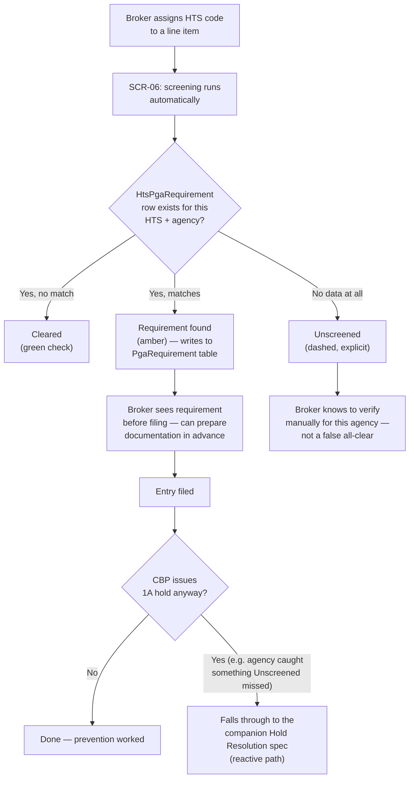

# PGA-by-HTS Screening & Reference Data

**Status:** Draft · **Date:** 2026-09-01 · **Audience:** Engineering · Product · Compliance · **Triggered by:** Gap review of the PGA Hold Resolution spec

> **Companion doc.** This spec is the **preventive** counterpart to [`PGA-HOLD-RESOLUTION-AND-ASSISTS.md`](./PGA-HOLD-RESOLUTION-AND-ASSISTS.md), which is **reactive**: it composes and submits the message set *after* CBP has already issued a 1A hold. This document is about whether Qubere can tell a broker, before CBP ever gets involved, that a given HTS code needs FDA/USDA/EPA/FWS/CPSC/NHTSA review at all. They are genuinely separate bodies of work — this one is a data-content problem first and an engineering problem second — and are intentionally kept as two documents rather than one, so each can be sized and prioritized on its own.

## Overview

`P0` · Data + Engineering

A large share of entries touch at least one Partner Government Agency requirement. Today, Qubere's ability to tell a broker *in advance* that a shipment's HTS code triggers FDA, USDA/APHIS, EPA, FWS, CPSC, or NHTSA review is effectively nonexistent: the reference table that should carry this mapping (`HtsPgaRequirement`) has zero real rows, the ingestion service that would have populated it was deleted, and the live screening route matches on crude keyword/HTS-prefix heuristics covering only 3 of 6 target agencies. Missing a real requirement here doesn't fail loudly — it produces a shipment that sails through Qubere's screening and then gets held or refused at the border, which is the worst possible failure mode for a compliance product: a confident wrong answer.

**Agencies in scope:** FDA · USDA/APHIS · EPA · FWS · CPSC · NHTSA — the same six as the companion Hold Resolution spec, intentionally, not the full 15+ CBP recognizes. Expanding beyond these six is future scope.

## User Stories

- As a **customs broker**, when I classify a line item or create an entry, I want to know immediately whether the HTS code I've assigned triggers a PGA requirement — before I file, not after CBP holds the shipment.
- As a **broker**, I want to trust that "no PGA requirement found" actually means Qubere checked and found nothing — not that Qubere doesn't have data for that agency yet. A false all-clear is worse than no screening at all.
- As a **compliance manager**, I want to see which agencies and HTS ranges currently have real reference data behind them, so I know where Qubere's screening can be trusted and where a broker still needs to check manually.
- As **product/compliance leadership**, I want an explicit decision point on how the underlying HTS-to-PGA reference data gets sourced (licensed dataset vs. manual regulatory research vs. CBP's own CATAIR files) before engineering commits to a specific ingestion approach.

## Functional Requirements

### Reference Data Sourcing — the open question this spec can't resolve alone

**SCR-01 — Decide the data source before building an ingestion pipeline** `P0`

`docs/apps/customs/data/README.md` already marks "PGA Requirements by HTS" as `NOT_YET_IMPLEMENTED`, describing it as fixed-width parsing of CBP's ACE CATAIR Appendix PGA across 15+ agencies — a large, ongoing-maintenance undertaking, not a one-time import. The deleted `pgaIngestionService.ts` hardcoded 4 rows (2 FCC, 1 DOT, 1 EPA — zero FDA/USDA/FWS/NHTSA) and was not real ingestion. Before engineering builds anything, product/compliance needs to choose one of three paths, each with a different build:

- **License a commercial customs-data provider** with a maintained PGA cross-reference feed — fastest path to real coverage, ongoing vendor cost, engineering builds an importer against their format.
- **Parse CBP's own CATAIR Appendix PGA files directly** — no vendor cost, but engineering owns fixed-width parsing and must track CBP's own update cadence; this is the path the deleted service attempted and abandoned after 4 rows.
- **Manually curate the six target agencies at HTS-heading level** (not full CATAIR granularity) as an MVP, authored by product + a licensed CHB — matches the pattern already used for the companion spec's per-agency field matrices, narrower scope, no parser to build, but coverage is heading-level, not HTS-line-level, and needs explicit disclosure as such (see SCR-04).

This spec assumes option 3 (manual MVP) as the default recommendation given it reuses a pattern already accepted elsewhere in this program, but that's a product/compliance call, not an engineering one.

### Data Model & Ingestion

**SCR-02 — Populate the existing HtsPgaRequirement table; don't build a parallel one** `P0`

The model already exists and fits (`packages/db/prisma/schema.prisma:8338`):

```prisma
model HtsPgaRequirement {
  id           String   @id @default(cuid())
  htsNumber    String   // 10-digit HTS code
  agencyCode   String   // FDA | EPA | DOT | USDA | TTB | FCC | CPSC
  programCode  String?  // e.g. "DEV" for FDA Devices, "TSCA" for EPA Chemical
  isMandatory  Boolean  @default(true)
  formCodes    String[] // e.g. ["FDA_2877", "EPA_3540_1"]
  guidanceText String?  @db.Text
  createdAt    DateTime @default(now())
  updatedAt    DateTime @updatedAt
  @@unique([htsNumber, agencyCode])
}
```

Extend it with data-governance fields rather than replacing it — add a migration (`<timestamp>_add_hts_pga_requirement_governance`):

```sql
ALTER TABLE "HtsPgaRequirement" ADD COLUMN "sourceType" TEXT NOT NULL DEFAULT 'manual'; -- manual | vendor_feed | catair_parse
ALTER TABLE "HtsPgaRequirement" ADD COLUMN "sourceRef" TEXT;      -- vendor dataset id, or curator name/date
ALTER TABLE "HtsPgaRequirement" ADD COLUMN "verifiedAt" TIMESTAMP;
ALTER TABLE "HtsPgaRequirement" ADD COLUMN "htsGranularity" TEXT NOT NULL DEFAULT 'line'; -- line | heading | chapter
```

`htsGranularity` matters directly for SCR-04 — a heading-level MVP row must never be presented to a broker with the same confidence as a real line-level CATAIR match.

**SCR-03 — Rewrite the screening route to query real data, not keywords** `P0`

`apps/custom/src/app/api/pga/screen/route.ts` (lines 53-88) currently does inline `desc.includes("food"|"medical"|"pharma")` and `hts.startsWith("9018"|"8537"|"8517"|"8481")` checks for only `SCREENED_AGENCIES = ["FDA","FCC","EPA"]` — no USDA/APHIS, FWS, NHTSA, or CPSC logic exists at all today. Replace the matching logic with a query against `HtsPgaRequirement` by HTS code (and heading/chapter prefix per `htsGranularity`) for all six target agencies. Keep writing results to `PgaRequirement` (shipment-line-item-scoped) as today — this changes what feeds that table, not its shape or its consumers (including the companion spec's Feature 1, which reads `PgaRequirement` to decide which agencies/fields apply to a hold).

### Coverage Transparency — the requirement that makes this safe to ship partial

**SCR-04 — Never present missing data as clearance** `P0`

Given the severity if this is wrong (a missed requirement means a hold or a refused entry), the screening result for every (HTS code, agency) pair must be one of three states, never collapsed into a binary pass/fail:

- **Cleared** — a real `HtsPgaRequirement` row was checked and no requirement applies.
- **Requirement found** — a row matched (feeds `PgaRequirement` as today).
- **Unscreened** — no data exists yet for this HTS/agency combination, shown explicitly as "not yet screened," never silently omitted or folded into Cleared.

This is the single requirement that makes it safe to ship with partial (even heading-level MVP) coverage rather than waiting for full data.

> This repo already has a related pattern worth reusing for the spirit of this requirement: `docs/apps/customs/data/README.md` documents a **Zero-Fabrication Policy** — datasets marked `NOT_YET_IMPLEMENTED` show a `⚠ On Roadmap` badge in the Platform Admin Console, return HTTP 422 if triggered, and never return synthetic/fake success. Model the Unscreened state the same way: explicit, never silently faked.

**SCR-05 — Coverage dashboard for compliance managers** `P1`

A simple internal view (not broker-facing) showing, per agency, how many HTS headings/lines have real reference data vs. are Unscreened — so compliance leadership can see where screening can be trusted and prioritize which agency to source data for next.

### Proactive Surfacing

**SCR-06 — Screen by default, not as a manual button** `P1`

Today, screening only runs when a broker clicks "Screen line items against FDA, FCC and EPA rules" in `ComplianceChecksPanel.tsx` (shipment detail page) — opt-in, easy to skip. Once SCR-03's real screening lands, run it automatically on HTS classification/assignment and on entry creation (same trigger points as the companion spec's AST-04 assist matching), surfacing Requirement-found and Unscreened states inline rather than waiting for a manual click.

## UX Spec

The core UX problem is representing three states (Cleared / Requirement found / Unscreened) without making "Unscreened" look like a minor afterthought — it needs to be as visible as a real finding, because treating it as an afterthought is exactly how a broker ends up trusting a screening pass that never actually happened.

**UX sketch — Line item, PGA screening states.**

| Agency | State | Display |
|---|---|---|
| FDA | Cleared | ✓ green check — "Cleared — no requirement found" |
| USDA | Requirement found | ⚠ amber — "Requirement found — Lacey Act declaration" |
| FWS | Unscreened | dashed border, italic "?" — "Unscreened — no reference data yet for this HTS range" |

Cleared and Unscreened are visually distinct on purpose — green check vs. dashed/italic "?" — so a broker scanning quickly can't mistake "we don't know" for "you're fine."

## User Flow



The rightmost branch is the honest acknowledgment that this spec reduces holds, it doesn't eliminate them — coverage will be partial for a while, and the companion Hold Resolution spec remains the necessary reactive backstop regardless of how good screening gets.

## API & File Map

| Route | Method | Permission | Notes |
|---|---|---|---|
| `/api/pga/screen` | POST | `pga.review` | Rewritten per SCR-03; same route, real query behind it |
| `/api/pga/requirements` | GET | `pga.read` | Coverage dashboard data (SCR-05), filter by agency/htsGranularity |
| `/api/pga/requirements/import` | POST | `pga.update` (admin-restricted) | Bulk-load curated/vendor data per SCR-01's chosen source |

**Files to modify**
- `apps/custom/src/app/api/pga/screen/route.ts` — replace keyword logic with `HtsPgaRequirement` query (SCR-03)
- `apps/custom/src/app/app/shipments/[id]/ComplianceChecksPanel.tsx` — add automatic trigger + three-state rendering (SCR-04, SCR-06)
- `packages/db/prisma/schema.prisma` — governance columns on `HtsPgaRequirement` (SCR-02)

**Files to create**
- `packages/db/prisma/migrations/<timestamp>_add_hts_pga_requirement_governance/`
- Import tooling for SCR-01's chosen data source (shape depends entirely on that decision — not specified further here)
- `apps/custom/src/app/app/compliance/pga-coverage/page.tsx` — SCR-05 dashboard

## Acceptance Criteria

- [ ] Product/compliance has explicitly chosen a data source (vendor feed / CATAIR parse / manual curation) before an ingestion pipeline is built — documented as a decision, not defaulted silently.
- [ ] Every (HTS, agency) screening result renders as exactly one of Cleared / Requirement found / Unscreened — no state is ever collapsed into another.
- [ ] Screening runs automatically on HTS classification and entry creation, not only via manual trigger.
- [ ] `/api/pga/screen` queries `HtsPgaRequirement` for all six target agencies — no agency silently falls back to zero coverage without showing Unscreened.
- [ ] A compliance manager can see, per agency, real coverage vs. Unscreened via the dashboard.
- [ ] A Requirement-found result feeds the same `PgaRequirement` table the companion Hold Resolution spec already reads — no divergent or duplicate requirement record.
