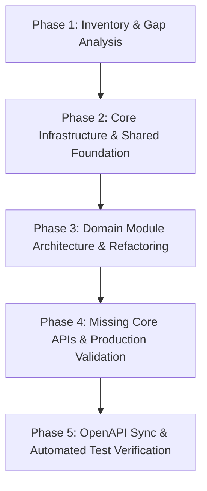

# Qubere API Gap Analysis & Production Readiness Audit

## 1. Executive Summary

Qubere is an enterprise trade compliance, customs clearance, drawback, refund, and tariff simulation platform built on Next.js 16 (App Router), TypeScript, and Prisma ORM with PostgreSQL. 

While the system has a comprehensive database schema and UI routing layer, an in-depth code audit of `src/app/api/` reveals that the current API implementation layer is predominantly prototype-grade. Key domain operations rely on synthetic fallbacks, unvalidated default records (e.g. hardcoded duty rates like `2.8%`, default HTS codes like `8481.80.5090`, and fixed refund amounts), GET side-effects (seeding test data inside read queries), floating-point arithmetic for currency calculations, missing idempotency controls, and route handlers directly containing inline business logic without service encapsulation.

This document serves as Phase 1 of the backend refactoring effort, inventorying all 29 API sub-directories, evaluating their maturity, detailing security and database model gaps, and outlining a structured 5-phase implementation plan to transition Qubere to an enterprise production foundation.

---

## 2. Current API Endpoint Inventory & Maturity Assessment

| Domain / Path | Methods | Current Maturity | Key Deficiencies / Hardcoded Behaviors |
| :--- | :--- | :--- | :--- |
| `/api/bonds` | GET, POST | **Prototype** | POST defaults surety to `"Roanoke Insurance Group"` and auto-generates random bond numbers if omitted. Missing surety/CBP verification status and active period validations. |
| `/api/classification/classify` | POST | **Prototype** | Generates synthetic decision records. Falls back to hardcoded HTS `8481.80.5090`, fixed duty `2.8%`, and arbitrary `97%` confidence. Auto-creates shipments if missing. |
| `/api/products/normalize` | POST | **Prototype** | Simple regex stripping (`/256gb\|black.../gi`). Defaults missing fields to `"PN-9901"`, `"Germany"`, HTS `8481.80.5090`, and `2.8%` duty. |
| `/api/reconcile` | POST | **Prototype** | Mutates/creates synthetic `ReconciliationIssue` records on every POST using static rules (`quantity % 100 !== 0`). Pulls arbitrary shipments if `shipmentId` omitted. |
| `/api/exceptions` | GET | **Prototype** | **GET endpoint mutates database** by seeding default `ExceptionItem` rows if count is zero. Lacks optimistic concurrency and formal state transitions. |
| `/api/compliance/audits/run` | POST | **Prototype** | Hardcodes static checklist strings and static risk scores (12 vs 65). Pulls arbitrary first filing if `filingId` is omitted. |
| `/api/drawback/match` | POST | **Prototype** | Calculates refund using floating-point multiplication (`* 0.035 * 0.99`). Does not check historical quantity consumption or prevent over-allocation. |
| `/api/drawback/claims` | GET, POST | **Prototype** | POST creates claims with static fallback total `$4500.0` or sum of unvalidated matches. Uses random six-digit numbers for CBP claim numbers. |
| `/api/shipments` | GET, POST | **Prototype** | POST defaults importer name to `"ABC Manufacturing India Pvt Ltd"`, hardcodes readiness score `85` and risk score `20`. |
| `/api/filing/[id]/transmit` | POST | **Prototype** | Transmits directly without ABI schema validation. Creates simulated `CustomsResponse` without a provider adapter pattern. |
| `/api/filing/[id]/entry-summary` | POST | **Prototype** | Generates mock 7501 calculation with floating-point math (`totalDuties * 0.003464`). |
| `/api/simulator/compare` | POST | **Prototype** | Performs client-triggered floating point landed cost comparisons without source dataset versioning. |
| `/api/simulator/scenarios/[id]/calculate` | POST | **Prototype** | Uses `0.003464` MPF and `0.00125` HMF floating-point multipliers directly in route handler. |
| `/api/advisory/origin-determination` | POST | **Prototype** | Auto-creates `TradeAgreement` rows on the fly inside route handler; defaults regional value content to `65.0%`. |
| `/api/advisory/query` | POST | **Prototype** | Mock response generator using template strings and `includes("china")` heuristic. |
| `/api/refunds/opportunities/scan` | POST | **Prototype** | Hardcodes `totalDuties * 0.4` or `0.15` multiplication for estimated refunds. |
| `/api/refunds/psc` | GET, POST | **GET, POST** | Auto-calculates `origDuty * 0.7` for corrected duty. |
| `/api/documents/upload` | POST | **Partial** | Stores file with random confidence `85-99%`. Pulls arbitrary default shipment if missing. |
| `/api/documents/[id]/extractions` | GET | **Prototype** | **GET endpoint mutates database** by seeding `ExtractionField` rows if empty. |
| `/api/hts` | GET | **Prototype** | **GET endpoint mutates database** by calling `ensureHtsSeeded()` on read. |
| `/api/hts/[code]` | GET | **Partial** | Reads HTS details cleanly, but lacks dataset version metadata. |
| `/api/admin/account` | PATCH | **Production-Capable** | Proper permission checks (`account.manage`) and audit logging. Needs response standardization. |
| `/api/admin/users` | POST, PATCH | **Partial** | Exposes raw `token` in `USER_INVITED` audit metadata log. Needs token hashing and exclusion from logs. |
| `/api/findings` | GET, POST | **Prototype** | GET endpoint seeds default findings if empty. |
| `/api/findings/[id]/assign` | PATCH | **Partial** | Updates assignee cleanly but lacks optimistic lock check. |
| `/api/findings/[id]/resolve` | PATCH | **Partial** | Updates status cleanly but lacks resolution evidence validation. |
| `/api/importers-of-record` | GET, POST | **Partial** | Creates IOR records without IRS EIN format validation or CBP validation. |
| `/api/importers-of-record/[id]/poa` | POST | **Partial** | Creates Power of Attorney records. |
| `/api/pga/screen` | POST | **Prototype** | Returns mock agency flags based on HTS string search. |
| `/api/platform-admin/accounts` | GET, POST | **Partial** | Creates enterprise accounts. Role creation done inline. |
| `/api/regulatory` | GET | **Partial** | Lists regulatory updates. |
| `/api/regulatory/[id]/impacted` | GET | **Partial** | Lists impacted shipments for regulatory updates. |
| `/api/risk/brokers` | GET | **Partial** | Calculates broker SLA metrics. |
| `/api/risk/suppliers` | GET | **Partial** | Returns supplier risk scores. |
| `/api/screening/dps` | POST | **Partial** | Screen restricted parties (DPS). |
| `/api/screening/embargo` | POST | **Partial** | Screen embargoed destinations. |
| `/api/telemetry` | POST | **Partial** | Logs telemetry events. |
| `/api/trade-intel/benchmarks` | GET | **Partial** | Industry benchmark queries. |

### 2.1 Partner API (`/api/v1`) — added after this Phase 1 audit

The inventory above is scoped to the 29 session-authenticated `/api/` sub-directories
audited at Phase 1; it does not cover the separate, API-key-authenticated
`/api/v1/*` surface (intake, HTS, classification-cases, and — as of this
addendum — Country Embargo Screening). Recording the one new addition here so
it isn't silently missing from this document:

| Domain / Path | Methods | Current Maturity | Key Deficiencies / Hardcoded Behaviors |
| :--- | :--- | :--- | :--- |
| `/api/v1/compliance/embargo-screening` | GET, POST | **Production Foundation** | Reads/rescreens through the same deterministic engine and shared presentation layer (`screeningQuery.ts`) as the chat assistant's embargo tools — no separate or duplicated logic. Scope-gated (`embargo.read`, `embargo.screen`), tenant-scoped by API key, audit-logged. Known engine limitations (country-group/CCL evidence-only, no CLEAR→PARTIAL auto-downgrade in the engine's own stored status) are the same ones the assistant surface already discloses, not new gaps introduced by this route. |

The rest of `/api/v1/*` remains outside the scope of this audit and should be
inventoried separately rather than assumed clean by omission.

---

## 3. Detailed Gap Analysis

### 3.1 Security & Tenant Isolation Gaps
1. **Raw Invitation Token Leakage**: `/api/admin/users` stores the unhashed raw invitation token directly in `AuditLog.metadata` (`metadata: { token: invitation.token }`), violating credential security standards.
2. **Missing Fine-Grained Permission Guards**: Most business routes (e.g. `/api/filing/[id]/transmit`, `/api/drawback/claims`, `/api/bonds`, `/api/classification/classify`) check `getAccountContext()` but do not check domain-specific permissions such as `filings.submit`, `drawback.claim`, or `classification.approve`.
3. **Cross-Tenant Access Vectors**: Handlers retrieving nested entities (e.g. updating line items or documents) rely on primary keys without verifying that every referenced sub-entity belongs to `ctx.accountId`.

### 3.2 Integrity, Idempotency & Concurrency Gaps
1. **Lack of Idempotency**: Consequential POST endpoints (`/api/filing/[id]/transmit`, `/api/drawback/claims`, `/api/compliance/audits/run`, `/api/refunds/psc`) lack request hashing and idempotency key enforcement. Re-submitting results in duplicate claims and duplicate audit records.
2. **Missing Optimistic Concurrency**: Mutable workflow entities (`Shipment`, `CustomsFiling`, `ExceptionItem`, `DrawbackClaim`) lack `version` columns and `updatedAt` preconditions, making concurrent broker updates susceptible to lost updates.
3. **Floating-Point Currency Arithmetic**: Monetary calculations (duties, landed costs, drawback refunds) rely on native JavaScript floats (`totalDuties * 0.003464`, `matchedQuantity * unitPrice * 0.035 * 0.99`), introducing rounding bugs.

### 3.3 Regulatory & Regulatory Data Integrity Gaps
1. **GET Side-Effect Seeding**: Endpoint handlers for `GET /api/exceptions`, `GET /api/documents/[id]/extractions`, `GET /api/hts`, and `GET /api/findings` issue database `create` or `createMany` queries when records are absent, violating HTTP GET semantics and breaking read-only replicas.
2. **Fabricated Default Values**:
   - Bonds auto-default `suretyName` to `"Roanoke Insurance Group"` and generate random string numbers.
   - Classification defaults unknown items to `8481.80.5090` at `2.8%` duty with `97%` confidence.
   - Product normalization defaults missing HTS to `8481.80.5090` and country to `Germany`.
   - Drawback matching assumes 99% refund rates with arbitrary $4,500 claims.
3. **Lack of Source/Version Metadata**: Regulatory decisions and tariff calculations fail to record dataset revision identifiers, effective date ranges, or provider provenance.

### 3.4 Architecture & API Design Gaps
1. **Fat Route Handlers**: Route handlers directly contain database queries, business rules, mock generators, and response formatting, hindering unit testing.
2. **Inconsistent Error Envelope**: Routes return ad-hoc error formats (`{ error: string }`, `{ message: string }`) instead of a standardized `ApiErrorResponse` with request IDs, typed error codes, and details.
3. **Missing Pagination & Cursor Support**: Collections such as `GET /api/shipments`, `GET /api/exceptions`, and `GET /api/drawback/claims` return unbounded arrays.

---

## 4. Missing Database Models & Schema Expansion Requirements

To support production-grade operations and domain requirements, the Prisma schema must be updated with the following models/fields:

1. **`IdempotencyRecord`**:
   - `id`, `accountId`, `idempotencyKey`, `requestHash`, `statusCode`, `responseBody` (Json), `expiresAt`, `createdAt`.
2. **`RegulatoryDatasetVersion`**:
   - `id`, `datasetName` (e.g. HTSUS, CBP_RULINGS), `revisionNumber`, `effectiveDate`, `expirationDate`, `sourceUrl`, `createdAt`.
3. **`ClassificationCase` & `ClassificationCandidate`**:
   - Persistent workflow models for standalone multi-candidate AI & human classification reviews with GRI rule references and ruling citations.
4. **`InventoryLot` & `DrawbackAllocation`**:
   - Proper inventory balance tracking (`importedQty`, `availableQty`, `reservedQty`, `claimedQty`) for decimal-safe FIFO/LIFO drawback reservation.
5. **Optimistic Locking (`version` field)**:
   - Add `version Int @default(1)` to `Shipment`, `CustomsFiling`, `ExceptionItem`, `DrawbackClaim`, `PostSummaryCorrection`, `CanonicalProduct`.

---

## 5. Recommended Implementation Roadmap

### Phase 2: Core Infrastructure & Shared Foundation
- Implement unified API error envelope (`ApiErrorResponse`) and standardized response helpers.
- Implement Zod schema validation middleware for body, query, and path parameters.
- Build reusable authorization guards for role/permission checks (`requirePermission`).
- Implement `Idempotency-Key` persistence middleware.
- Add optimism version checking helper (`checkVersion`).
- Build structured audit logger excluding sensitive tokens.
- Add Prisma schema migration for `IdempotencyRecord`, `ClassificationCase`, `InventoryLot`, and `version` columns.

### Phase 3: Route Handler Refactoring & Domain Services
- Migrate domain logic into modular service layers (`src/modules/*`):
  - `bonds`: Bond validation, surety verification interface.
  - `classification`: HTS lookup, GRI hierarchy filtering, legal source citations.
  - `products`: Normalization pipeline, alias deduplication.
  - `reconciliation`: Field-level cross-document rule engine.
  - `exceptions`: Workqueue state machine, assignment & SLA tracking.
  - `drawback`: Inventory lot balance engine, FIFO/LIFO decimal-safe allocation.
  - `compliance`: Audit control definition runner, defense file manifest builder.
  - `filings`: Filing case workspace, ABI transmission provider abstraction (`MockCustomsTransmissionProvider`).
  - `tariff`: Decimal-safe landed cost calculation engine.
- Purge database mutation logic from all GET handlers.

### Phase 4: Production Verification & Test Suite Integration
- Separate development seed fixtures into standalone CLI scripts (`scripts/seed.ts`).
- Expand Vitest unit and integration test suite covering cross-tenant isolation, idempotency replay, optimistic lock conflict (409), invalid input (400), and business rule failures (422).
- Generate/update OpenAPI 3.0 specification (`docs/openapi.json`).

---
*Documented by Antigravity AI - Qubere Production Backend Audit*
