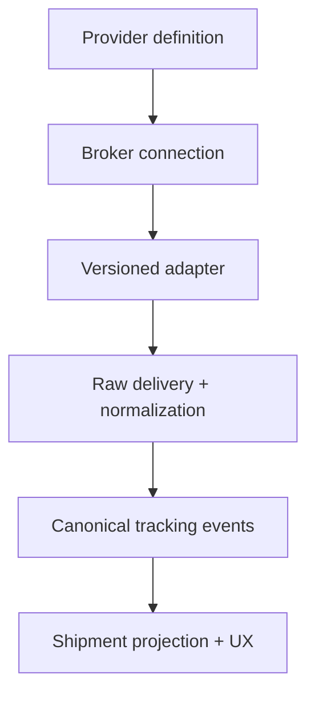

# Extensible Shipment Tracking Provider System

Status: Slice 1 and Slice 1.5 (Customs-first platformization) shipped and merged to `main` (PR #136, commit `b0b91576`; follow-up fix `59b9b503`). `@qubere/tracking` and `@qubere/tracking-platform` exist as packages; only the generic-webhook adapter (`packages/tracking/src/adapters/genericWebhook.ts`) is implemented so far. Slice 2 (first commercial/ocean provider adapter) and Slice 3 (ACE/customs + multimodal adapters) are not started.
Owner: Platform / TMS / Customs
Applies to: `apps/custom`, `apps/tms`, shared shipment data model

## Outcome

Qubere presents one trustworthy shipment-tracking experience regardless of whether a broker uses Qubere's preferred provider, an existing visibility vendor, a carrier feed, EDI, or a generic webhook.

The external system supplies observations. Qubere owns the normalized event history, ETA history, shipment projection, customs correlation, deadlines, exceptions, permissions, audit trail, and user experience.

Shipment remains the durable work object. Tracking is a capability of the existing Shipment workspace, not a separate shipment record or a parallel application.

## Product principles

1. Never fabricate movement, carrier, container, customs-release, or ETA data.
2. Keep physical movement, customs disposition, terminal availability, carrier release, and delivery status independent.
3. Show the source, event time, receive time, freshness, and whether a value is actual, estimated, planned, inferred, or corrected.
4. Preserve every ETA observation instead of overwriting history.
5. A provider outage must degrade to an honest stale/error state; it must not erase the last verified event or imply that the shipment stopped.
6. Provider choice is tenant configuration stored in the database. Adding a provider must not require changes to shipment pages or business rules.
7. Executable adapter implementations remain versioned code. Database records select an adapter, configure a broker connection, and map provider codes to Qubere's canonical vocabulary.
8. Secrets are never stored in plaintext provider configuration. The database stores Secret Manager references only.

## Source-of-truth boundaries

| Question | Authority | Qubere behavior |
| --- | --- | --- |
| Where is the container or vehicle? | Carrier, terminal, rail, telematics, or visibility provider | Normalize into transportation tracking events. |
| When will it arrive? | Provider estimate plus its provenance | Append an `EtaObservation`; retain prior estimates. |
| Did CBP release, hold, or examine the cargo? | ACE/ABI response | Record a CBP-sourced event; never infer release from vessel or terminal activity. |
| Is the container available for pickup? | Terminal/rail availability plus active holds and carrier release | Derive a readiness explanation from independent statuses. |
| Was the shipment delivered? | Carrier/POD source | Require an actual delivery event or accepted POD. |
| What deadline is next? | Qubere rules applied to authoritative anchors | Store the anchor and rule version with the calculated deadline. |

"Vessel arrived," "cargo arrived in ACE," "CBP released," and "terminal available" are different facts and must never collapse into one `cleared` field.

## Architecture

### Decision: pure adapters and infrastructure runtime are separate packages

The initial slice located database orchestration inside the TMS application. That was acceptable for proving the adapter contract but conflicts with Customs-first ownership and would force every product to copy security-sensitive ingestion code.

The implementation therefore uses two shared layers:

- `@qubere/tracking` contains pure provider contracts, registry behavior, payload verification/parsing, and event mapping. It has no database or product dependency.
- `@qubere/tracking-platform` contains connection resolution, Secret Manager access, raw-payload storage, tenant/client scoping, idempotent persistence, ETA history, subscription state, and operational health.

Customs and TMS expose their own thin HTTP routes and inject product policy through an `onSignalPersisted` hook. Customs recomputes regulatory deadlines when an ETA or arrival anchor changes. TMS evaluates logistics exceptions. Neither policy is embedded in the provider adapter or platform runtime.

This is an intentional divergence from the first TMS-local implementation. It gives Customs the first production consumer while keeping the same runtime available to TMS and future products.

### Database-managed provider catalog

`TrackingProviderDefinition` is platform-managed reference data.

Required fields:

- Stable provider key and display name
- Adapter key used by the versioned code registry
- Provider status: active, preview, deprecated, or disabled
- Supported transport modes
- Supported capabilities such as push events, polling, ETA, terminal availability, rail, POD, and subscription management
- Authentication type and non-secret configuration schema
- Documentation URL and operational notes

The provider catalog is data, not a TypeScript union. Platform operators can enable, disable, label, and describe providers without editing shipment code.

### Tenant connection configuration

Reuse `IntegrationConfig` for broker/client connections with `category = SHIPMENT_TRACKING`.

Tracking connections require:

- `providerDefinitionId`
- Unguessable `connectionKey` for inbound endpoint routing
- Environment, base URL, priority, and default selection
- Non-secret `configJson`
- `credentialRef` and `webhookSecretRef` pointing to Secret Manager
- Active/error/inactive state
- Last health check, last event, last successful sync, and last error
- Optional client scope; account-wide connections remain the default

Legacy plaintext `apiKey` and `apiSecret` fields must not be used by shipment-tracking integrations.

### Database-managed event mapping

`TrackingProviderEventMapping` translates provider codes into Qubere's stable event vocabulary.

Mappings support exact, prefix, contains, and fallback matches. A broker connection may override the platform mapping for a provider. Specific connection mappings win over provider defaults, then lower numeric priority wins.

Each mapping defines:

- Provider raw code or match pattern
- Canonical `eventType`
- Planned/estimated/actual classifier
- Carrier/terminal/port/AIS/CBP/provider source type
- Active flag and priority
- Optional human description

Mapping changes must be audited and testable against captured fixtures before production activation.

### Versioned adapter contract

Every adapter implements the same behavioral boundary:

- Describe capabilities
- Validate the database connection configuration
- Verify webhook authenticity against the resolved secret
- Parse one delivery into zero or more provider signals
- Create, refresh, pause, and end subscriptions when supported
- Poll a shipment snapshot when supported
- Return structured retryability and provider error codes

The adapter must not write directly to Shipment, TrackingEvent, ETA, exceptions, or audit tables. It returns provider signals to the shared ingestion service.

The registry is intentionally code-backed. Storing executable adapter logic in the database would make security review, rollback, testing, and deployments unsafe.

## Ingestion requirements

1. Resolve the connection by its unguessable key.
2. Reject inactive, missing, or incorrectly categorized connections.
3. Resolve secrets from Secret Manager only after the connection is known.
4. Verify the signature before parsing or persisting business data.
5. Store or reference the raw delivery with a hash, receive time, provider delivery ID, and processing status.
6. Resolve the shipment inside the connection's account/client scope. A request body may never choose another tenant.
7. Apply connection-specific mapping, then provider mapping, then explicit fallback.
8. Write canonical events idempotently using account, provider, connection, and provider event identity.
9. Append ETA observations and preserve earlier estimates.
10. Update subscription and connection health.
11. Project business state and evaluate exceptions asynchronously where possible.
12. Return success for already-processed deliveries so provider retries stop.

### Retry and failure behavior

- Authentication or signature failures are not retried by Qubere.
- Rate limits and transient upstream failures are retried with bounded exponential backoff and jitter.
- Parsing and mapping failures go to a dead-letter state with the raw payload reference.
- Unknown shipment references remain unmatched for operator resolution; they are not silently dropped or attached to the first shipment.
- A circuit breaker pauses aggressive polling after repeated provider failures.
- Provider and connection health are visible to administrators and shipment users.

## Provider selection

When tracking starts, Qubere selects a connection in this order:

1. Explicit connection selected for the shipment
2. Client-scoped default supporting the shipment mode and identifiers
3. Account-wide default supporting the shipment mode and identifiers
4. Lowest-priority-number active compatible connection
5. `NOT_CONFIGURED` when none is compatible

There is no automatic simulation fallback in production workspaces.

## Canonical event requirements

Every normalized tracking event retains:

- Account, shipment, leg, stop, and equipment relationships
- Provider definition and connection identity
- Provider event ID and Qubere idempotency key
- Raw event code and canonical event type
- Classifier: planned, estimated, or actual
- Event time, source-updated time, and Qubere receive time
- Location, timezone, UN/LOCODE, and coordinates when supplied
- Source type and provider
- Confidence and inferred/correction flags
- Superseded-event relationship
- Raw payload hash/reference and normalized data

Canonical event names are a stable product contract. Provider mappings may change; existing stored event meaning must not mutate retroactively without an explicit reprocessing operation and audit record.

## Shipment experience

The existing Shipment page is the foundation.

The Tracking experience must provide:

- One clear journey headline: current verified movement and next meaningful milestone
- Independent physical-movement and customs rails
- Current ETA with change from the prior observation and source
- Current location with the event timestamp, receive timestamp, and freshness
- Provider connection state: connected, syncing, stale, error, inactive, or not configured
- Tracking references by type with the primary reference clearly marked
- Upcoming regulatory and commercial clocks
- Verified event timeline with actual/estimated/planned labels
- Corrections and inferred values visibly distinguished
- Actionable empty and degraded states

Do not show a map when there are no real coordinates. Do not show `0`, `--`, a fictional carrier, or a fictional milestone as a substitute for unavailable data.

## Security and tenancy

- Every database read/write is scoped by `accountId`; client-scoped connections add `clientId` constraints.
- Connection keys are routing identifiers, not credentials.
- Webhook verification uses constant-time comparison or the provider's official signing algorithm.
- Secrets are resolved only server-side and never logged, serialized into React props, or returned from APIs.
- Raw payload retention follows customer data-retention policy and stores large bodies in object storage by reference.
- Configuration, mapping, credential-reference, and provider-selection changes are audited.
- Replay tools require an authorized administrative action and preserve the original delivery identity.

## Operational requirements

- Metrics: delivery count, verification failures, parse failures, mapping misses, duplicates, unmatched shipments, processing latency, event freshness, polling lag, and provider error rate
- Dashboards by provider, connection, account, and mode
- Structured logs include request ID, delivery ID, connection ID, shipment ID, and provider event ID; never secret values or full payloads
- Health checks validate credentials and provider reachability without generating shipment events
- Provider sandbox fixtures and replayable contract tests
- Kill switch at provider and connection level
- Backfill/polling workers use leases so multiple workers cannot process the same subscription concurrently

## Acceptance criteria for the first production slice

- The current generic carrier webhook operates through the adapter contract.
- Provider definitions and raw-code mappings are loaded from the database.
- Broker connections are tenant-scoped `IntegrationConfig` records using secret references.
- The global `WEBHOOK_SECRET`/`ERP_WEBHOOK_API_KEY` tracking path is removed.
- Duplicate deliveries are acknowledged without duplicate events or ETA observations.
- A shipment ID belonging to another account is rejected.
- Unknown provider codes create an explicit `TRACKING_UPDATE` only through a configured fallback mapping.
- Connection health and source freshness appear in the Shipment tracking experience.
- No configured source results in `NOT_CONFIGURED`, not simulated data.
- Unit tests cover adapter registration, signature verification, mapping precedence, idempotency, and tenant isolation.

## Customer journey validation matrix

| Customer journey | Expected outcome | Automated evidence |
| --- | --- | --- |
| Broker configures an account- or client-scoped provider | The connection is stored with a secret reference, validated adapter configuration, and no invented sync timestamp | Shared connection command tests |
| Provider sends a correctly signed arrival and ETA update | One normalized event, ETA observation, subscription update, and healthy source projection are persisted for the owning tenant | Customs tracking customer-journey test |
| Provider retries the same delivery | The request is acknowledged as a duplicate without another event or ETA observation | Customs tracking customer-journey and platform ingestion tests |
| A different tenant's shipment identifier is submitted | The delivery is rejected and cannot mutate the shipment | Platform tenancy tests |
| Movement data arrives while the entry remains filed | The physical rail advances while the customs rail remains filed; carrier data never fabricates CBP release | Customs tracking customer-journey test |
| A new provider connection has only historical events from another source | The selected connection remains waiting until it supplies its own verified event | Customs projection tests |
| A source becomes stale, unhealthy, paused, or absent | The Shipment page names the state and offers the appropriate configure, start, or review action | Customs projection tests and source-card states |

Production promotion also requires clean typechecks, lint, database migration replay, schema-drift generation, unit tests, OpenAPI validation, and production builds for both Customs and TMS.

## Delivery sequence

### Slice 1 — foundation

- [x] Database provider catalog, broker connections, mapping rows, and indexes
- [x] Shared adapter contract and registry
- [x] Generic webhook adapter wrapping today's payload contract
- [x] Secret Manager resolver
- [x] Tenant-safe ingestion path and tests
- [x] Shipment connection-health UX
- [x] Database-backed TMS integration administration with enable/pause controls
- [x] Removal of fabricated connection cards, generated browser secrets, and shipment ETA/risk defaults

### Slice 1.5 — Customs-first platformization

- [x] Extract database/secrets/storage orchestration into `@qubere/tracking-platform`
- [x] Keep TMS behavior through a thin product-policy wrapper
- [x] Expose the signed, connection-specific webhook through Customs
- [x] Move Customs integration administration onto shared connection commands
- [x] Move TMS integration administration onto the same commands after the Customs path
- [x] Surface provider connection, waiting, stale, and error states in the Customs Shipment page
- [x] Validate the broker journey across connection setup, signed ingestion, idempotent retry, movement projection, source health, and customs-source boundaries

### Slice 2 — first commercial provider

- Implement the chosen ocean provider adapter
- Subscription lifecycle and webhook callbacks
- Terminal availability, holds, last free day, rail, and ETA mappings
- Provider health dashboard and replay/dead-letter operations

### Slice 3 — customs and multimodal depth

- ACE Cargo Release and Entry Summary status adapters into the same canonical event stream with CBP source authority
- Air and truck adapters based on committed customer demand
- Pickup-readiness derivation across customs, terminal, carrier, and payment conditions
